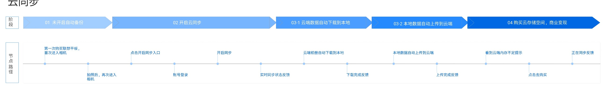
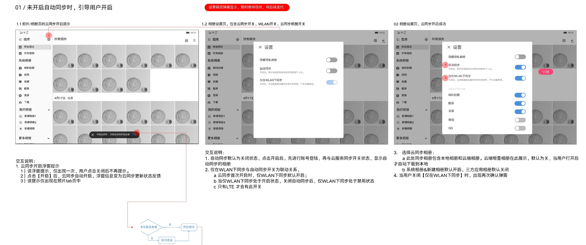
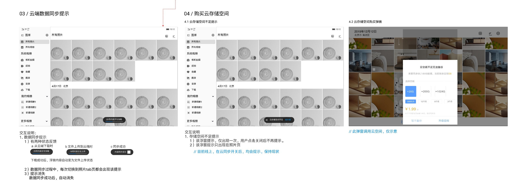

# 云同步

[返回图库索引](../../README.md) · [功能索引](../../functions.md) · [导航关系](../../navigation.md)

## 身份与适用范围

| 项目 | 内容 |
|---|---|
| 知识 ID | gallery.cloud_sync |
| 类型 | 跨页面主题 |
| 检索词 | 备份、下载上传、账号登录、云空间不足 |
| 主来源 | [S05 原始设计稿](../../sources/S05.png) |
| 来源文件名 | 13 云同步.png |
| 证据性质 | 设计稿知识，未经实机验证 |

正文中明确区分文字规则、图示状态与待确认事项。数值示例不自动视为固定产品参数；所有动作由当前测试任务决定。

## 1. 启用引导与流程

流程概要：未开启→入口→账号登录→开启同步→云端下载→本地上传→完成；空间不足时引导购买。

此主题跨首页、设置和购买弹窗，未虚构单一业务页面。设置入口见[设置](../../pages/settings/README.md)。

## 2. 开启提示与设置

照片tab有开启云同步浮窗，仅出现一次，关闭后不再提示；点击开启自动打开同步开关，浮窗改为状态反馈。说明限定照片tab出现。

自动同步默认关，启用需要账号状态；已登录与未登录分支见原图。云端相册默认不选，系统/新建相册默认选，第三方相册默认不选。

是否有“仅WLAN”选项取决于LTE设备条件，详见设置页。

## 3. 同步状态与空间不足

反馈状态：从云端下载、文件上传到云端、同步成功。下载完成后浮窗转为上传状态；同步过程中每次切换到照片tab都出现状态提示，成功后自动消失。

空间不足浮窗仅出现一次，关闭不再提示，仅照片页展示。蓝色批注说明当前线上在云同步开关开启后会提示并保持现状，与抽象空间不足触发条件存在区别，需核对版本。

购买弹窗仅示意，套餐、容量、价格不能作为实际购买规则。普通删除在涉及云端项目时文案明确本地和云端删除，参见[最近删除](../../pages/recently_deleted/README.md)。

## 待确认与使用边界

网络异常重试、冲突合并、账户退出数据处理及实际购买流程未提供。

图中箭头、红色编号、修订标签是设计批注，不是App控件。实际操作位置以实时截图/UI树为准；本文不提供点击坐标。可按需查看[整图预览](images/overview.jpg)或上述原始设计稿，优先读取当前相关局部图。
