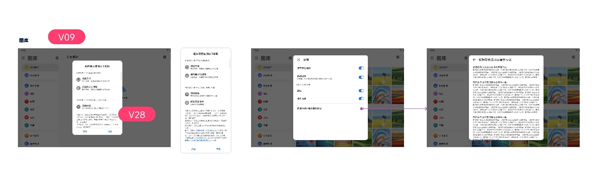

# CTA与首次授权弹窗

[返回图库索引](../../README.md) · [功能索引](../../functions.md) · [导航关系](../../navigation.md)

## 身份与适用范围

| 项目 | 内容 |
|---|---|
| 知识 ID | gallery.cta |
| 类型 | 跨页面主题 |
| 检索词 | CTA、授权、隐私协议、首次进入 |
| 主来源 | [S10 原始设计稿](../../sources/S10.png) |
| 来源文件名 | 18 CTA弹窗.png |
| 证据性质 | 设计稿知识，未经实机验证 |

正文中明确区分文字规则、图示状态与待确认事项。数值示例不自动视为固定产品参数；所有动作由当前测试任务决定。

## 1. 弹窗证据

原稿标题CTA弹窗，主体存在大块灰色占位，下面有系统权限/隐私相关弹窗及设置界面缩略示意，标记V09、V28。

结合[首页](../../pages/home/README.md)原稿只能确认首次进入涉及权限提示。本稿未提供完整可执行文字说明。

CTA同意与Android系统权限是可能不同的状态，不合并为一次授权。具体按钮、弹窗顺序、拒绝结果须以清晰原图及实际界面确认。

## 待确认与使用边界

未定义完整协议文案、授权列表、版本对应和拒绝分支；不得强制推断点击同意/允许。

图中箭头、红色编号、修订标签是设计批注，不是App控件。实际操作位置以实时截图/UI树为准；本文不提供点击坐标。可按需查看[整图预览](images/overview.jpg)或上述原始设计稿，优先读取当前相关局部图。
