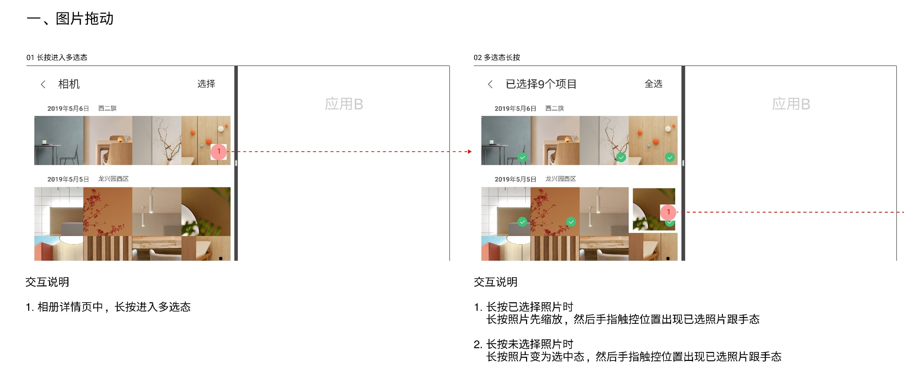
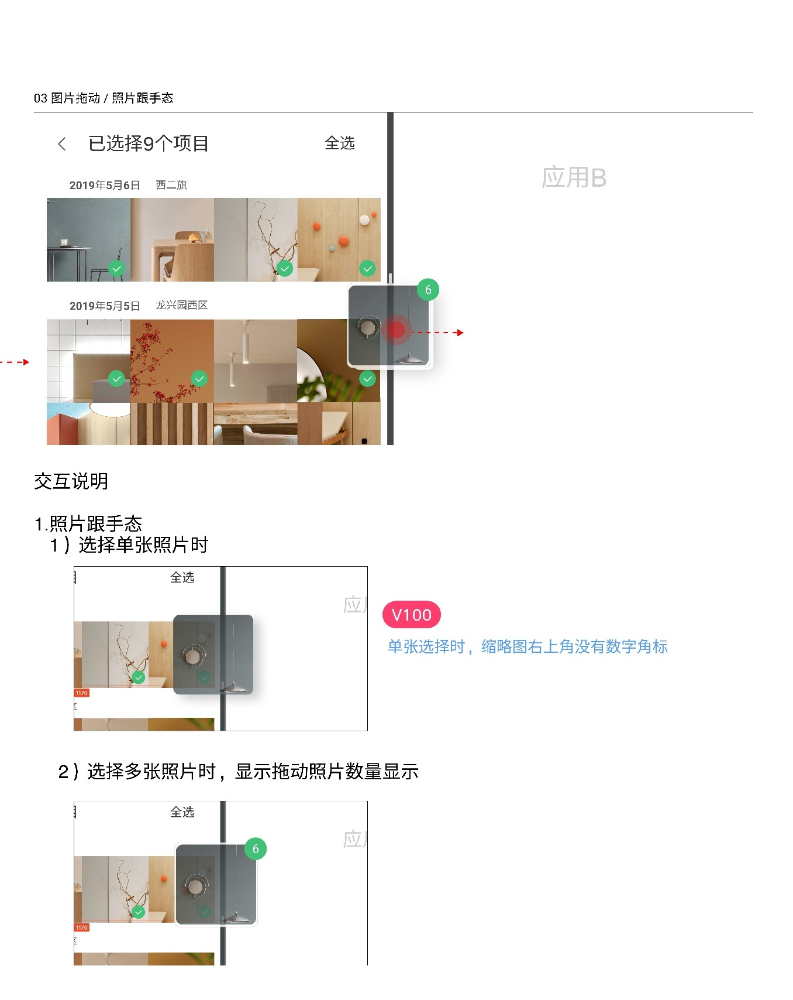

# 全局图片拖动

[返回图库索引](../../README.md) · [功能索引](../../functions.md) · [导航关系](../../navigation.md)

## 身份与适用范围

| 项目 | 内容 |
|---|---|
| 知识 ID | gallery.drag_drop |
| 类型 | 跨页面主题 |
| 检索词 | 长按、多选拖动、跨应用、跟手缩略图 |
| 主来源 | [S06 原始设计稿](../../sources/S06.png) |
| 来源文件名 | 14 全局图片拖动.png |
| 证据性质 | 设计稿知识，未经实机验证 |

正文中明确区分文字规则、图示状态与待确认事项。数值示例不自动视为固定产品参数；所有动作由当前测试任务决定。

## 1. 进入选择和起拖

相册详情列表长按进入多选。多选下长按已选照片：先缩放，再在手指触点显示已选照片跟手态；长按未选照片：先选中该照片，再形成跟手态。

此处“相册详情”是媒体列表，不是单张照片详情。

## 2. 跟手视觉与跨应用示意

单张拖动缩略图右上无数量角标；多张拖动显示数量。图示向分屏应用B方向拖动，但未规定接收应用、接受条件、落点和成功结果。

不能将拖动理解为必然移动原文件，也不能与所有相册的相册排序混为一谈。排序见[所有相册](../../pages/all_albums/README.md)。

## 待确认与使用边界

外部应用拒收、取消拖动、落点反馈和支持格式未提供。

图中箭头、红色编号、修订标签是设计批注，不是App控件。实际操作位置以实时截图/UI树为准；本文不提供点击坐标。可按需查看[整图预览](images/overview.jpg)或上述原始设计稿，优先读取当前相关局部图。
