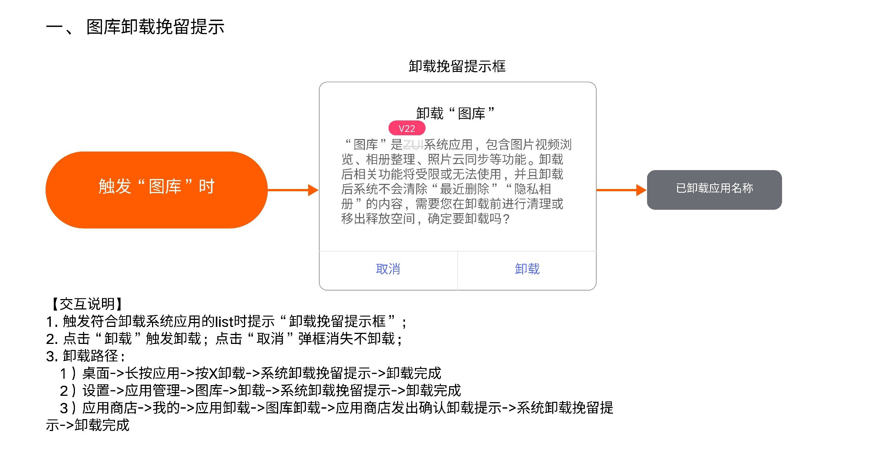
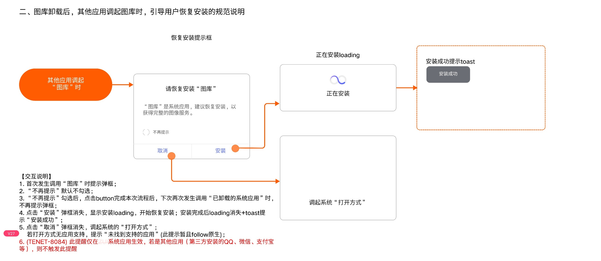
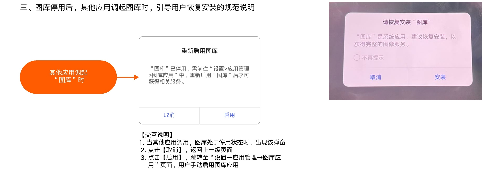

# 图库卸载、停用与恢复引导

[返回图库索引](../../README.md) · [功能索引](../../functions.md) · [导航关系](../../navigation.md)

## 身份与适用范围

| 项目 | 内容 |
|---|---|
| 知识 ID | gallery.lifecycle |
| 类型 | 跨页面主题 |
| 检索词 | 卸载挽留、恢复安装、启用、系统调用 |
| 主来源 | [S09 原始设计稿](../../sources/S09.png) |
| 来源文件名 | 停用及引导安装规范.png |
| 证据性质 | 设计稿知识，未经实机验证 |

正文中明确区分文字规则、图示状态与待确认事项。数值示例不自动视为固定产品参数；所有动作由当前测试任务决定。

## 1. 卸载挽留

触发图库卸载时显示系统应用卸载挽留框；取消关闭且不卸载，卸载执行后提示已卸载。

入口路径：桌面长按应用→卸载；设置→应用管理→图库→卸载；应用商店→我的→应用卸载→图库→商店确认→系统挽留。

挽留说明：卸载影响图库相关功能，且不会自动清理最近删除和隐私相册内容；这是本设计范围内的数据说明。

## 2. 卸载后的调用

系统应用调用已卸载图库时首次显示恢复安装框；不再提示默认未勾选，勾选并完成本次操作后下次不提示。

安装：弹窗关闭→正在安装loading→完成后Toast“安装成功”。取消：关闭弹窗并调起系统打开方式；无支持应用时提示“未找到支持的应用”。

红色批注明确：该提醒仅在系统应用生效；第三方安装的QQ、微信、支付宝等不触发。不要从“其他应用”概述扩大范围。

## 3. 停用后的调用

调用时若图库停用，弹“重新启用图库”。取消返回上一级；启用跳到设置→应用管理→图库应用，用户手动启用。

启用入口不是立即完成恢复安装；卸载和停用为不同状态。

## 待确认与使用边界

无网络恢复失败、安装失败、系统包卸载方式差异未给出。

图中箭头、红色编号、修订标签是设计批注，不是App控件。实际操作位置以实时截图/UI树为准；本文不提供点击坐标。可按需查看[整图预览](images/overview.jpg)或上述原始设计稿，优先读取当前相关局部图。
