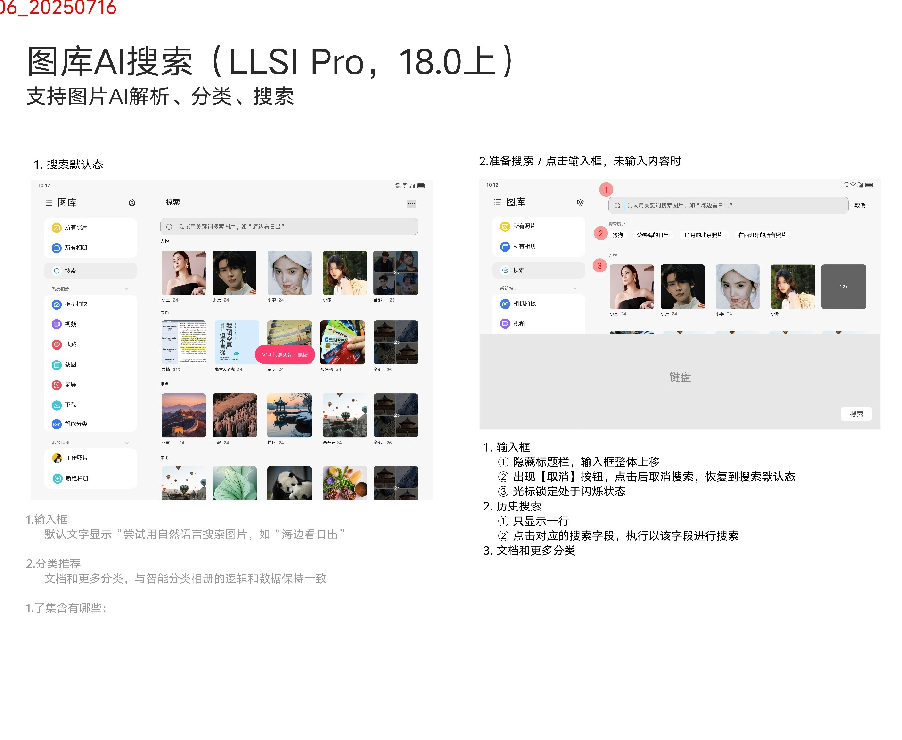
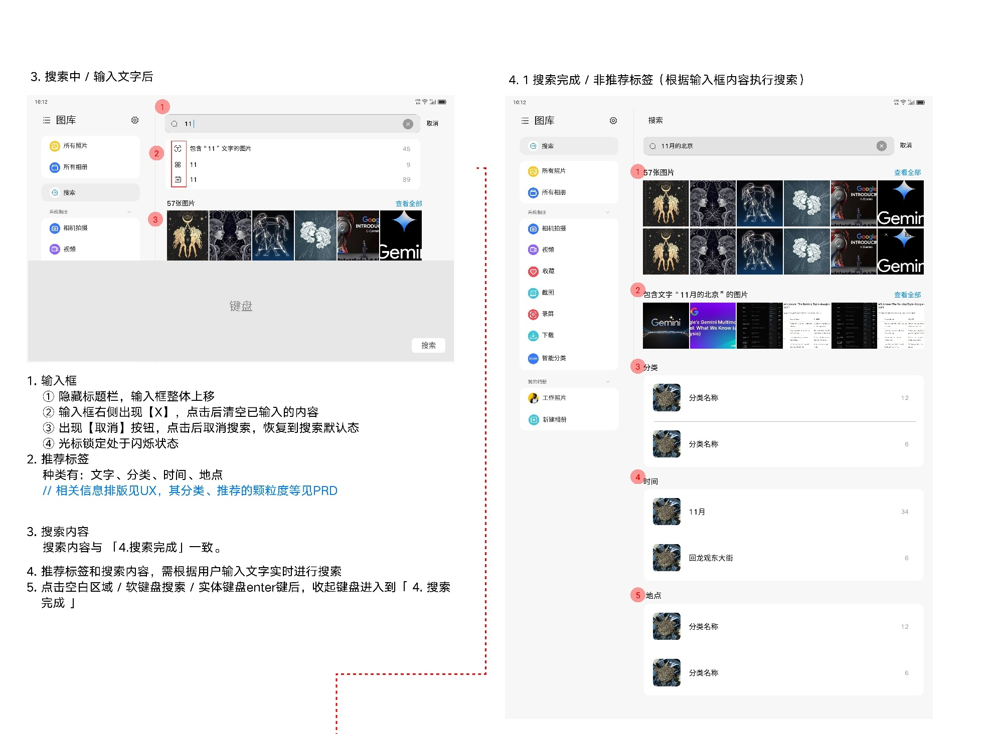
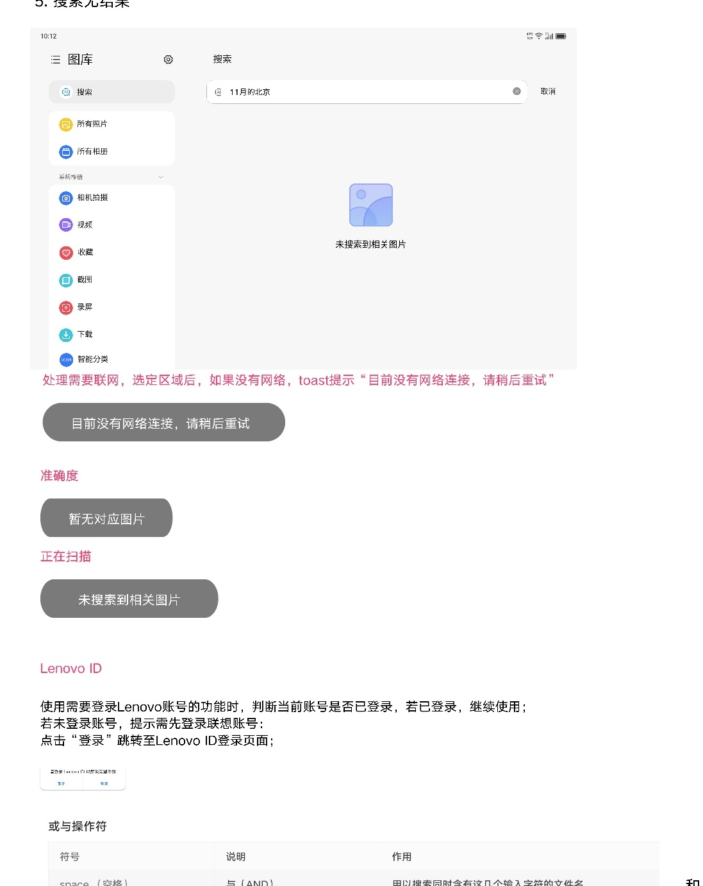
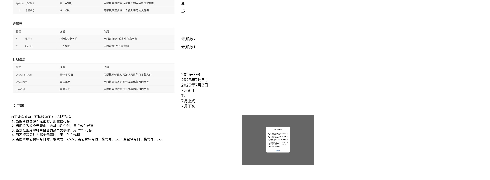
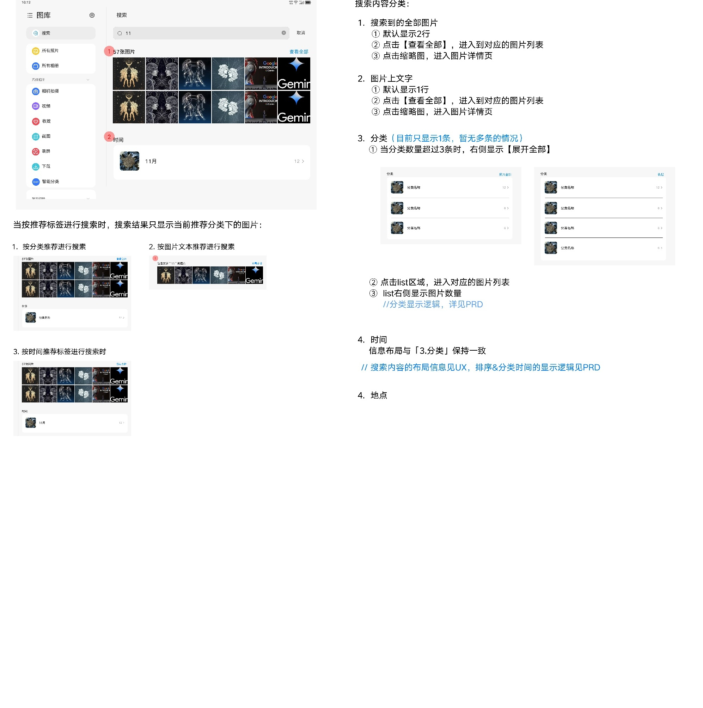

# 图库AI搜索

[返回图库索引](../../README.md) · [功能索引](../../functions.md) · [导航关系](../../navigation.md)

## 身份与适用范围

| 项目 | 内容 |
|---|---|
| 知识 ID | gallery.ai_search |
| 类型 | 页面及其局部状态 |
| 检索词 | 自然语言、文字、分类、时间、地点、搜索历史、无结果 |
| 主来源 | [S13 原始设计稿](../../sources/S13.png) |
| 来源文件名 | 20 AI搜索.png |
| 证据性质 | 设计稿知识，未经实机验证 |

正文中明确区分文字规则、图示状态与待确认事项。数值示例不自动视为固定产品参数；所有动作由当前测试任务决定。

## 1. 默认与输入

标题限定LLSI Pro、18.0上，标记V06_20250716。左侧搜索入口进入，默认搜索框提示自然语言搜索示例，如“海边看日出”；下方分类推荐与智能分类一致。

点击输入框：隐藏标题栏、输入框上移、聚焦闪烁光标，显示一行历史搜索，点击历史词执行搜索。取消恢复默认态。

有文字时右侧X清空；取消仍回默认态。

## 2. 搜索中与完成

输入后显示推荐标签：文字、分类、时间、地点；搜索内容随输入变化。点击空白、软键盘搜索或实体Enter收键盘进入搜索完成。

非推荐标签搜索结果分为全部照片、图片上文字、分类、时间、地点。全部照片默认2行、图片文字默认1行，查看全部进入对应图片列表；点缩略图进入详情。

分类列表行右侧数量，点击进入图片列表；超过3条显示展开全部，但稿件又注明当前仅1条，视为当前与设计扩展差异。

按推荐标签搜索只显示当前推荐分类下图片，不混成未限定搜索。

## 3. 无结果、网络和账号

未找到时显示“未搜索到相关图片”空态；另有“暂无对应图片”和扫描中的反馈示例，不将其混成同一状态。

需要联网的操作无网络时Toast“目前没有网络连接，请稍后重试”。需Lenovo账号功能检查登录，未登录提示并由登录进入Lenovo ID。

具体哪些搜索能力必需联网/登录未逐项说明，不假定整个搜索一律无法离线。

## 4. 语法及推荐结果

图中检索语法：空格为AND；竖线为OR；星号代表0个或多个字符；问号代表1个字符。

日期格式列出yyyy/mm/dd、yyyy/mm、mm/dd；旁注有自然语言日期示例。表格“文件名”检索与正文“图片元素”描述不完全一致，不承诺同一语法在全部搜索模式通用。

精确语义、分类排序与时间显示引用PRD，未随包提供。

## 5. 推荐标签结果的局部证据

推荐分类、文字、时间标签会限制结果范围；分类/时间条目点击进入对应列表。该局部图保留默认行数、查看全部和展开全部的来源说明。

## 待确认与使用边界

搜索排序、历史删除、最大输入长度、自然语言解析覆盖及模型准确率未定义。

图中箭头、红色编号、修订标签是设计批注，不是App控件。实际操作位置以实时截图/UI树为准；本文不提供点击坐标。可按需查看[整图预览](images/overview.jpg)或上述原始设计稿，优先读取当前相关局部图。
