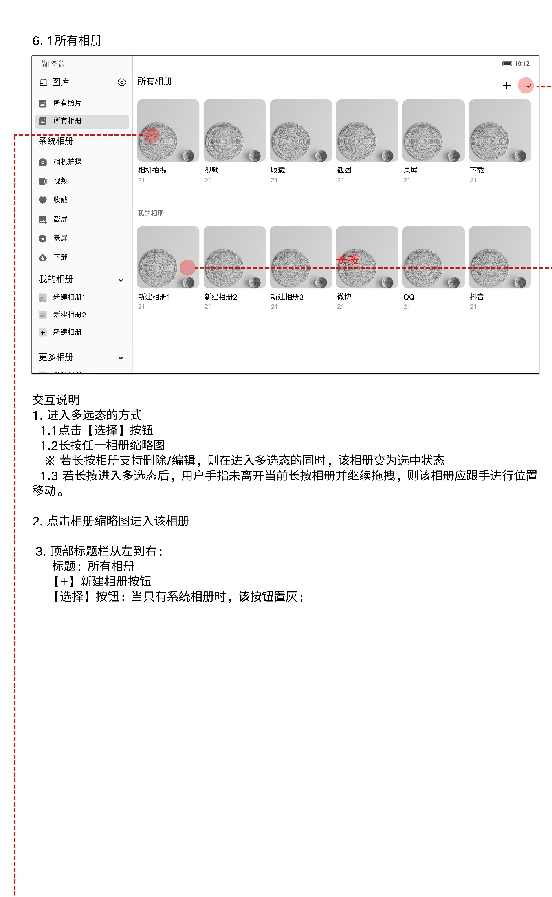
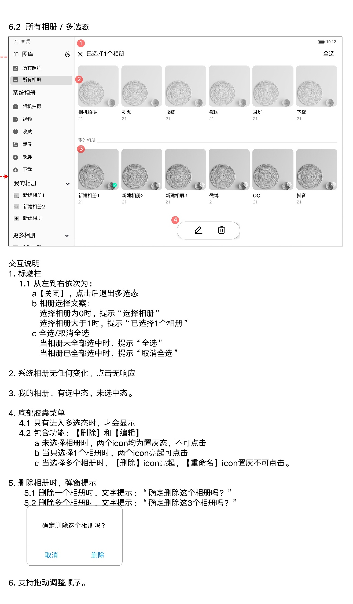
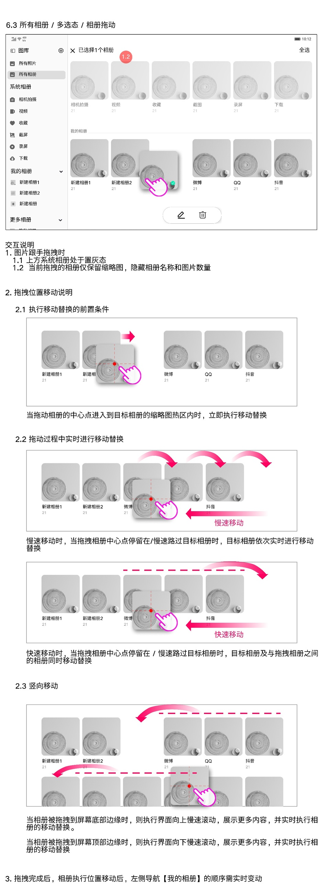
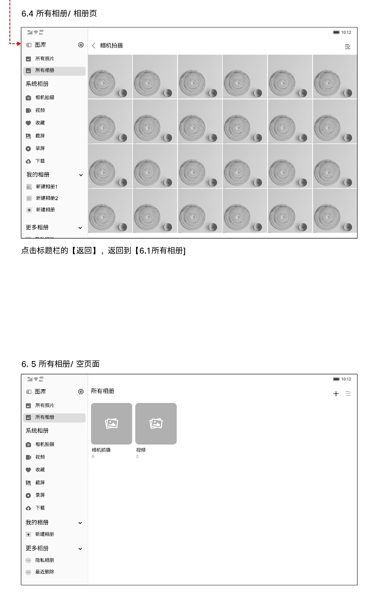
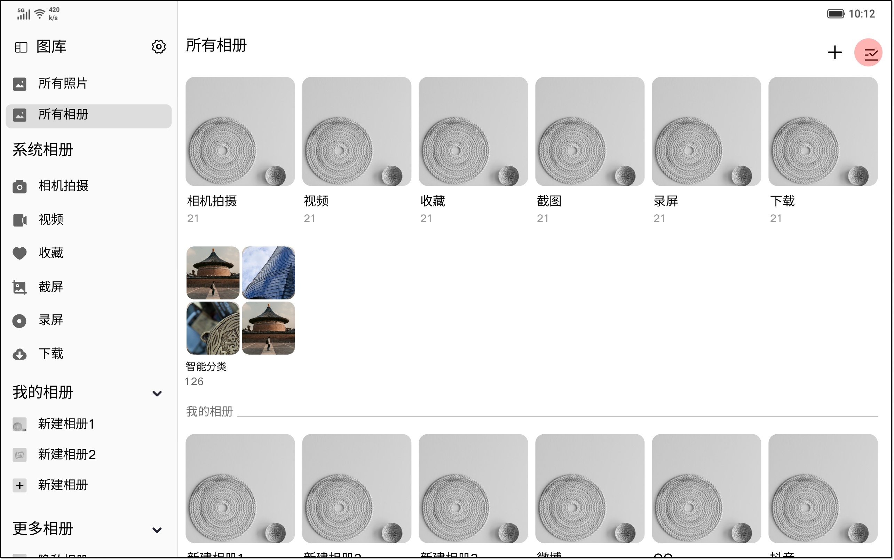

# 所有相册

[返回图库索引](../../README.md) · [功能索引](../../functions.md) · [导航关系](../../navigation.md)

## 身份与适用范围

| 项目 | 内容 |
|---|---|
| 知识 ID | gallery.all_albums |
| 类型 | 页面及其局部状态 |
| 检索词 | 相册列表、多选、删除重命名、拖动排序 |
| 主来源 | [S16 原始设计稿](../../sources/S16.png) |
| 来源文件名 | 6 所有相册.png |
| 证据性质 | 设计稿知识，未经实机验证 |

正文中明确区分文字规则、图示状态与待确认事项。数值示例不自动视为固定产品参数；所有动作由当前测试任务决定。

## 1. 列表与进入相册

入口：左侧“所有相册”。内容区上部为系统相册，下方为“我的相册”。右上+新建相册，选择图标进入相册多选。只有系统相册时选择按钮置灰。

点击相册缩略图进入该相册。顶部返回回到所有相册。普通系统相册见[系统相册](../system_albums/README.md)，用户相册见[我的相册](../my_albums/README.md)。

## 2. 相册多选规则

点击选择或长按一张可编辑/删除的相册缩略图进入多选；长按的相册同时选中。

顶部X退出多选；未选“选择相册”，已选“已选择{n}个相册”；右上全选/取消全选随状态变化。

系统相册不能被操作，点击无响应。底部编辑/重命名、删除仅在多选态出现：未选均禁用；选一个两项可用；选多个仅删除可用，重命名禁用。

删除会弹二次确认：“确定删除这个相册吗？”或“确定删除这{n}个相册吗？”。删除相册是否同时删除文件未说明。

## 3. 拖动排序

长按进入多选后保持按住并拖动，相册跟手移动。上方系统相册置灰；拖动相册只保留缩略图，隐藏名称和数量。

拖动相册中心进入目标缩略图区域立即发生移位；慢速经过依次移位，快速跨越时中间相册一起移位。

拖到屏幕底边，内容向上慢滚；拖到顶边，内容向下慢滚。拖动完成，左侧“我的相册”顺序同步变化。

## 4. 相册内容与空态

子相册标题栏返回入口回到所有相册。空态示例保留相机拍摄与视频两个系统相册卡片、数量为0；不能将此示例推成所有分类永远显示。

补充设计“2.1 图库首页/所有相册.png”展示系统相册下方的智能分类卡片，详见补充原图及[智能分类](../smart_albums/README.md)。

## 补充布局证据

来源：[S12：2.1 图库首页/所有相册.png](../../sources/S12.png)。仅是补充布局示例，不能从截图日期判定覆盖其他稿件。

## 待确认与使用边界

补充图与基础稿的导航/分类布局不同，版本对应关系未说明。

图中箭头、红色编号、修订标签是设计批注，不是App控件。实际操作位置以实时截图/UI树为准；本文不提供点击坐标。可按需查看[整图预览](images/overview.jpg)或上述原始设计稿，优先读取当前相关局部图。
