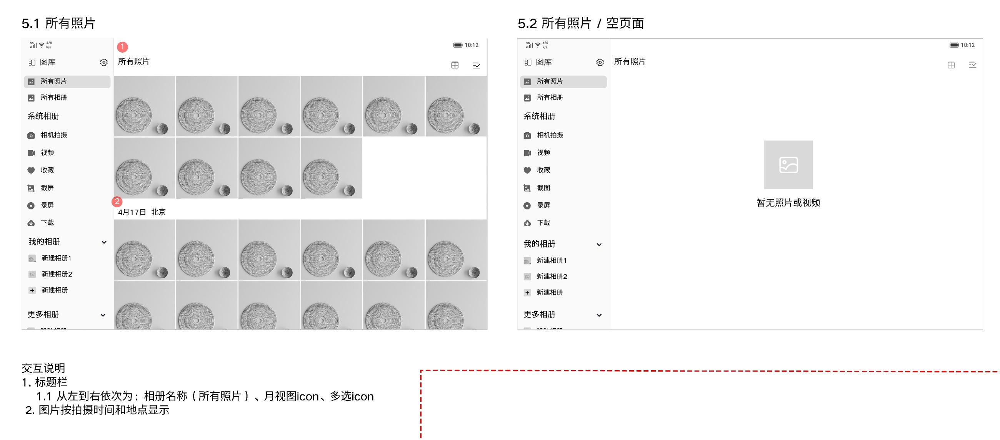
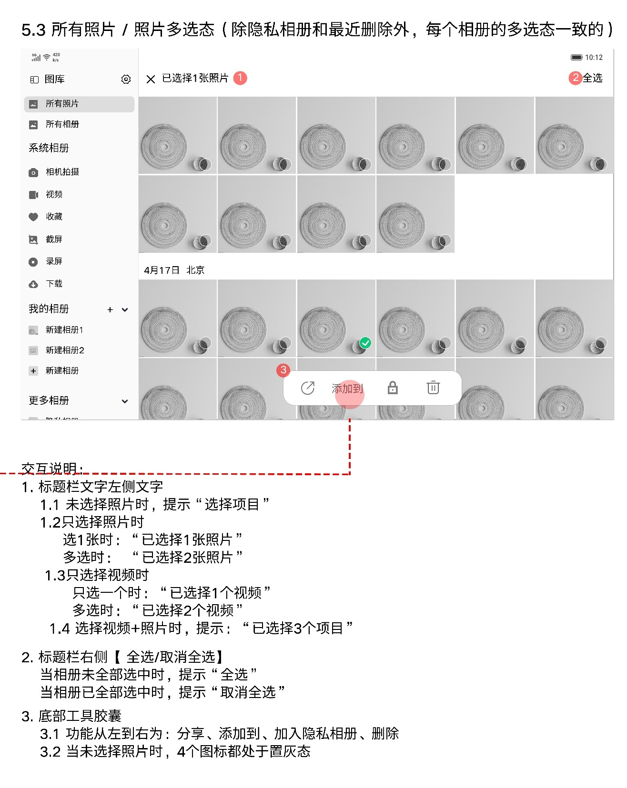
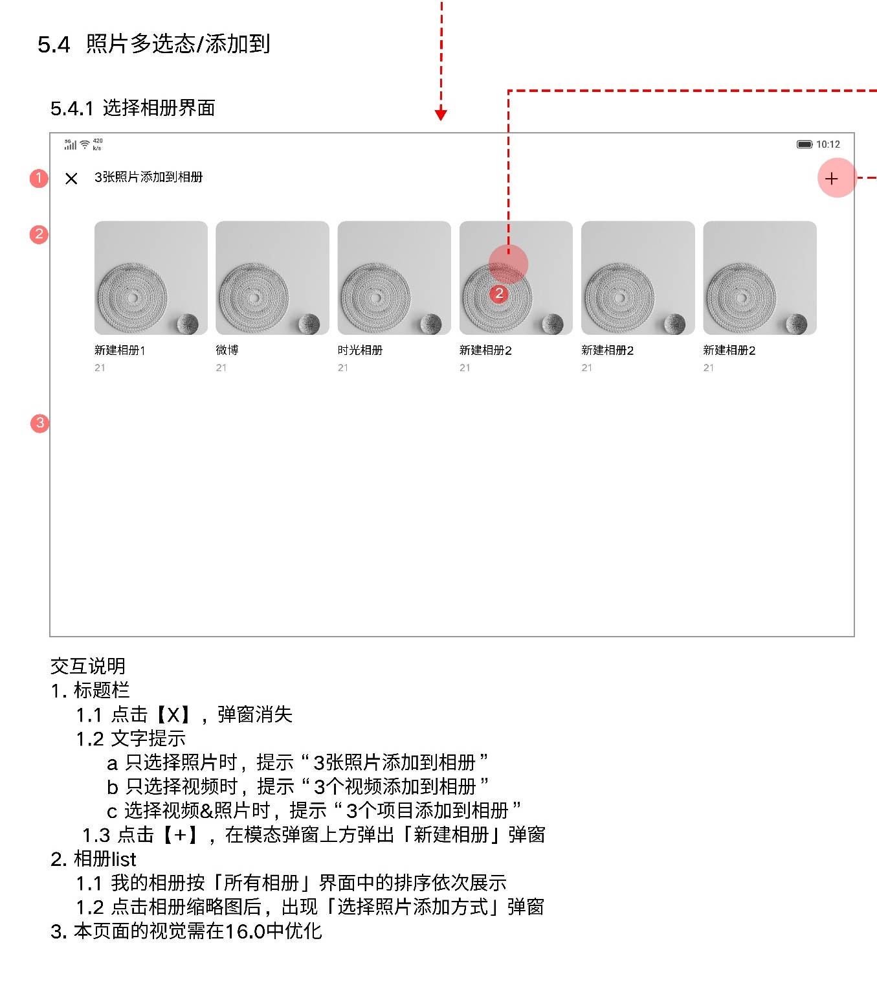
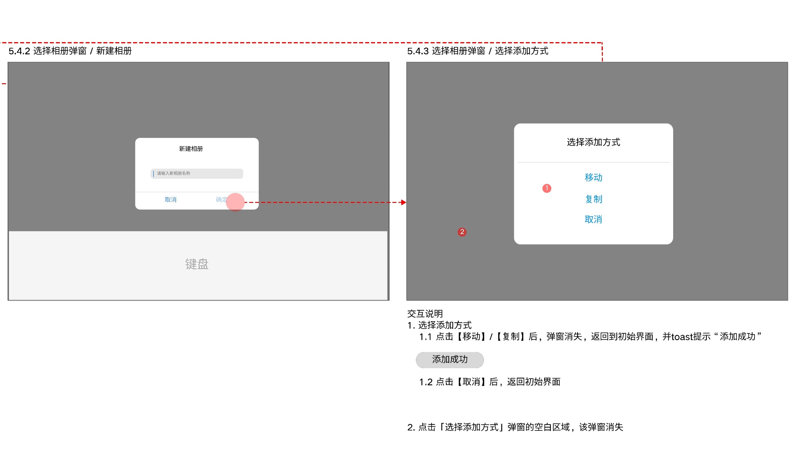

# 所有照片

[返回图库索引](../../README.md) · [功能索引](../../functions.md) · [导航关系](../../navigation.md)

## 身份与适用范围

| 项目 | 内容 |
|---|---|
| 知识 ID | gallery.all_photos |
| 类型 | 页面及其局部状态 |
| 检索词 | 照片网格、多选、添加到、移动复制 |
| 主来源 | [S15 原始设计稿](../../sources/S15.png) |
| 来源文件名 | 5 所有照片.png |
| 证据性质 | 设计稿知识，未经实机验证 |

正文中明确区分文字规则、图示状态与待确认事项。数值示例不自动视为固定产品参数；所有动作由当前测试任务决定。

## 1. 正常与空态

入口：左侧“所有照片”。标题栏依次为相册名称、月视图图标、多选图标；图片按拍摄时间和地点显示。空态中央显示“暂无照片或视频”。

单张媒体浏览见[照片详情](../photo_detail/README.md)或[视频详情](../video_detail/README.md)。日月切换见[首页](../home/README.md)。

## 2. 媒体多选

状态：未选、单选、多选、全选。标题：未选显示“选择项目”；纯照片为“已选择{n}张照片”；纯视频为“已选择{n}个视频”；混合为“已选择{n}个项目”。

右上：未全选显示“全选”；全选显示“取消全选”。底部从左至右：分享、添加到、加入隐私相册、删除。未选时四项均置灰。

设计明确普通相册多选一致，但排除隐私相册和最近删除。删除目标见[最近删除](../recently_deleted/README.md)，移入隐私见[隐私相册](../private_album/README.md)。

## 3. 选择目标相册

点击“添加到”进入目标相册选择界面。顶部X关闭此界面；标题根据已选媒体为“{n}张照片添加到相册”“{n}个视频添加到相册”“{n}个项目添加到相册”。

相册按“所有相册”页面“我的相册”排序展示。右上+打开新建相册弹窗；点击相册缩略图打开添加方式弹窗。本稿注明此页视觉需在16.0中优化。

## 4. 新建及添加方式

图示：新建相册输入名称后确认，连线到“选择添加方式”。添加方式有移动、复制、取消。

点击移动/复制：弹窗消失，返回“初始界面”，Toast“添加成功”。点击取消：返回“初始界面”。点击弹窗外空白处：弹窗消失。

“初始界面”具体是何层及选择状态是否保留未定义；不要硬编码返回正常态。此流程已有待处理媒体，与先建相册再选照片的流程不同。

## 待确认与使用边界

分享目标、移动/复制失败规则未说明；不把占位照片、日期、数量当固定数据。

图中箭头、红色编号、修订标签是设计批注，不是App控件。实际操作位置以实时截图/UI树为准；本文不提供点击坐标。可按需查看[整图预览](images/overview.jpg)或上述原始设计稿，优先读取当前相关局部图。
