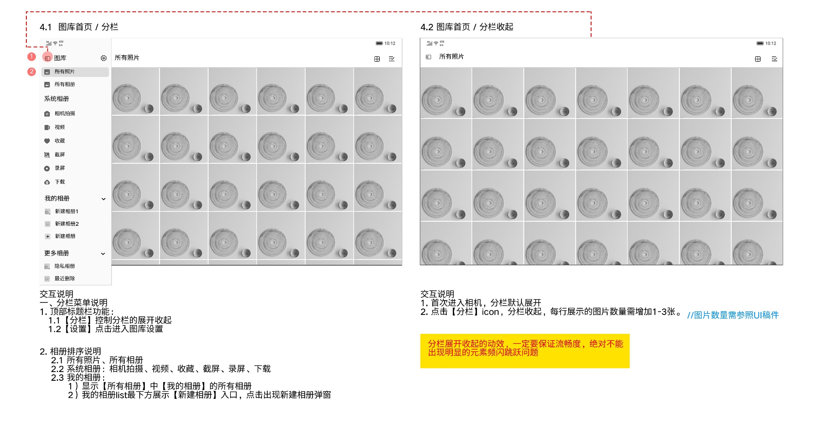
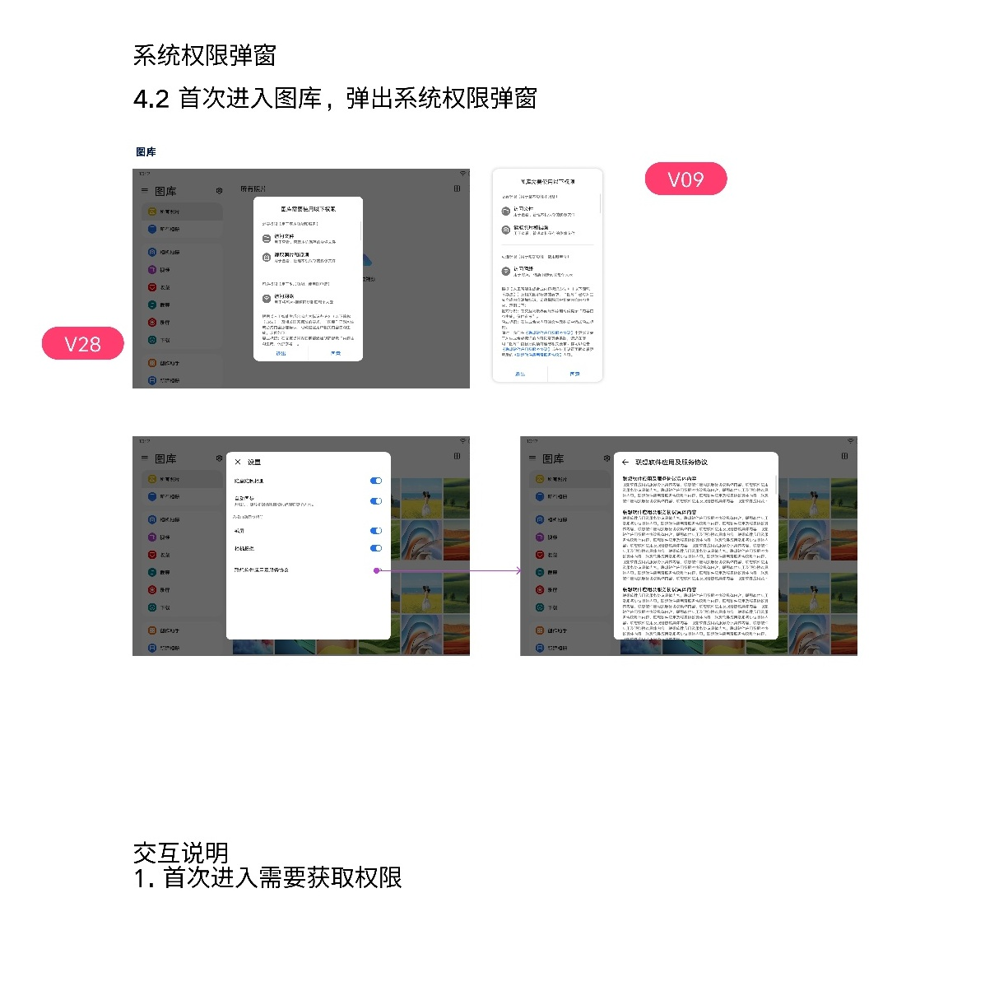
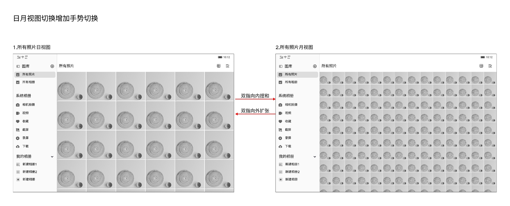

# 图库首页

[返回图库索引](../../README.md) · [功能索引](../../functions.md) · [导航关系](../../navigation.md)

## 身份与适用范围

| 项目 | 内容 |
|---|---|
| 知识 ID | gallery.home |
| 类型 | 页面及其局部状态 |
| 检索词 | 分栏、设置入口、导航、日月视图 |
| 主来源 | [S14 原始设计稿](../../sources/S14.png) |
| 来源文件名 | 4. 图库主界面布局说明.png |
| 证据性质 | 设计稿知识，未经实机验证 |

正文中明确区分文字规则、图示状态与待确认事项。数值示例不自动视为固定产品参数；所有动作由当前测试任务决定。

## 1. 布局与导航

首页采用左侧导航、右侧标题栏与媒体网格布局。左上分栏按钮控制导航展开/收起；“图库”右侧齿轮进入设置。示例当前分类为“所有照片”，左侧高亮。

导航顺序：所有照片、所有相册；系统相册（相机拍摄、视频、收藏、截屏、录屏、下载）；我的相册；更多相册（隐私相册、最近删除）。

“我的相册”显示所有相册中对应的用户相册，列表末尾为新建相册。设置细节见[设置](../settings/README.md)，新建规则见[我的相册](../my_albums/README.md)。

分栏收起后媒体网格每行图片增加1～3张，具体数量依UI适配，不固定列数。动效应流畅，避免明显频闪或跳跃。

## 2. 首次进入与权限

首次进入图库出现系统权限提示；具体选择按测试任务决定，关闭弹窗不代表授权成功。另见[CTA](../../features/cta/README.md)。

分栏说明原文为“首次进入相机，分栏默认展开”，与图库主题不一致：保留为设计歧义，不擅自改成图库的确定启动规则。

## 3. 日月视图

在所有照片媒体网格，日视图双指向内捏合→月视图；月视图双指向外扩张→日视图。月视图缩略图较小、每行更多。

默认视图、手势阈值及未展示的分栏/视图组合未定义。其他相册不自动继承日月视图能力。

## 待确认与使用边界

首页示例非完整功能清单；AI版本新增导航见智能分类/AI搜索资料，不假定所有版本首页相同。

图中箭头、红色编号、修订标签是设计批注，不是App控件。实际操作位置以实时截图/UI树为准；本文不提供点击坐标。可按需查看[整图预览](images/overview.jpg)或上述原始设计稿，优先读取当前相关局部图。
