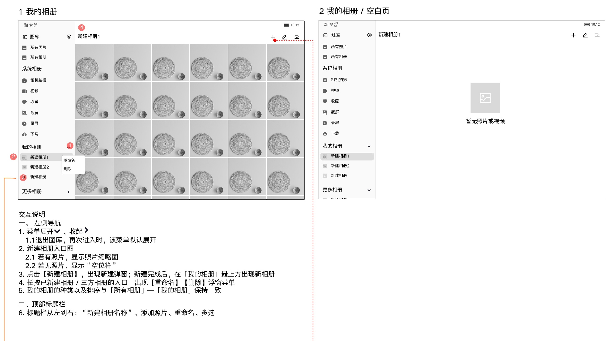
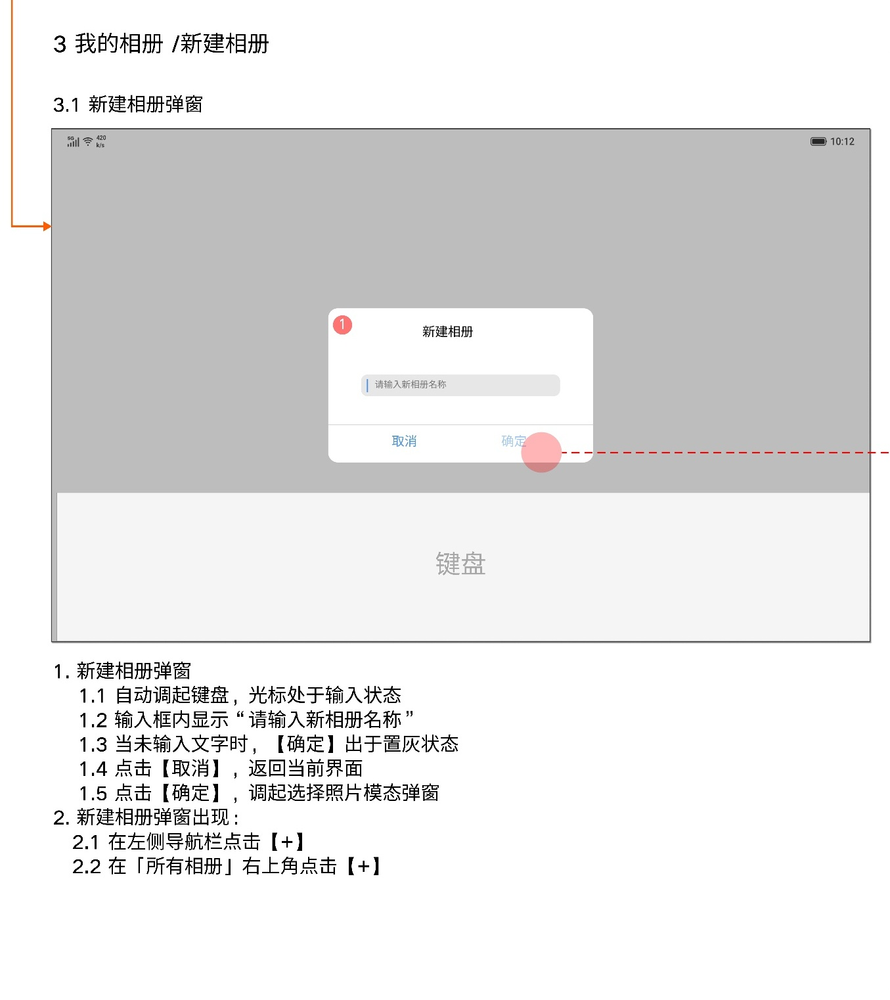
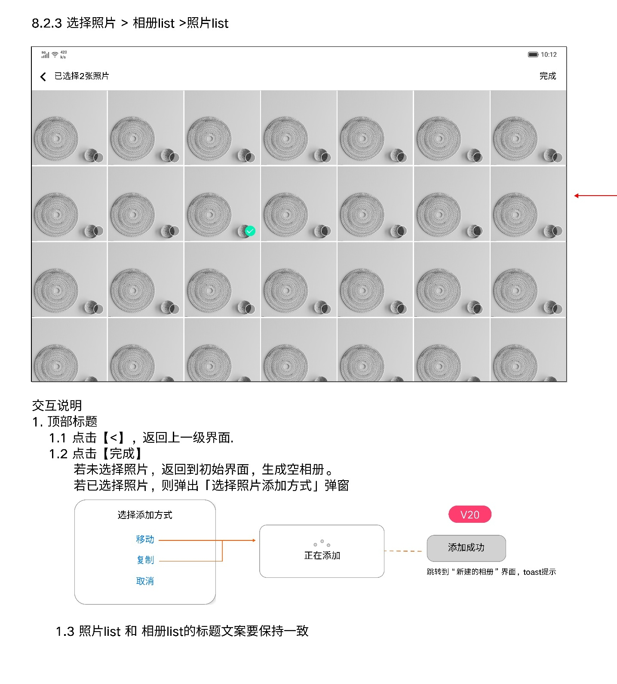
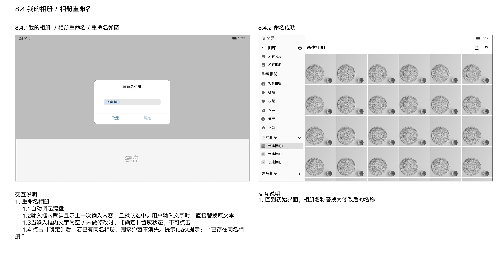

# 我的相册

[返回图库索引](../../README.md) · [功能索引](../../functions.md) · [导航关系](../../navigation.md)

## 身份与适用范围

| 项目 | 内容 |
|---|---|
| 知识 ID | gallery.my_albums |
| 类型 | 页面及其局部状态 |
| 检索词 | 新建、添加照片、重命名、用户相册管理 |
| 主来源 | [S18 原始设计稿](../../sources/S18.png) |
| 来源文件名 | 8 我的相册.png |
| 证据性质 | 设计稿知识，未经实机验证 |

正文中明确区分文字规则、图示状态与待确认事项。数值示例不自动视为固定产品参数；所有动作由当前测试任务决定。

## 1. 导航和相册页面

左侧“我的相册”分组有展开/收起；退出图库再进入，设计说明默认展开。这里与首页分栏开关不是同一状态。

有照片的相册显示照片缩略图；空相册显示空文件样式。新建完成的新相册出现在我的相册最上方。排序与所有相册一致。

长按左侧用户/第三方相册入口出现重命名、删除菜单。主区标题栏从左至右为相册名称、添加照片、重命名、多选。空态显示“暂无照片或视频”。

## 2. 新建相册

入口：左侧新建相册/加号、所有相册右上+。中央弹窗“新建相册”，自动弹出键盘并聚焦输入框；占位“请输入新相册名称”。

未输入时确定置灰；取消返回当前界面；确定调起选择照片模态界面。

## 3. 选择照片与完成

选择照片页左上返回上一级，右上完成。未选照片点击完成：回初始界面，生成空相册。已选时点击完成：出现移动/复制添加方式弹窗。

移动/复制后有“正在添加”反馈，结束Toast“添加成功”。照片列表和相册列表的标题文案保持一致。

稿件中间存在大块灰色占位，未展示的相册选择中间布局不能补全。

## 4. 重命名

重命名弹窗自动弹键盘；输入框填入旧名称并默认选中，输入直接替换。空名称或未修改时确定置灰。

确定后有同名相册：弹窗保留，Toast“已存在同名相册”；成功则回初始界面并更新相册名称。

此处明确的是重命名同名校验，不自动扩展到所有新建入口。

## 待确认与使用边界

删除用户相册是否保留源文件未明确；添加照片失败和非法字符规则未说明。

图中箭头、红色编号、修订标签是设计批注，不是App控件。实际操作位置以实时截图/UI树为准；本文不提供点击坐标。可按需查看[整图预览](images/overview.jpg)或上述原始设计稿，优先读取当前相关局部图。
