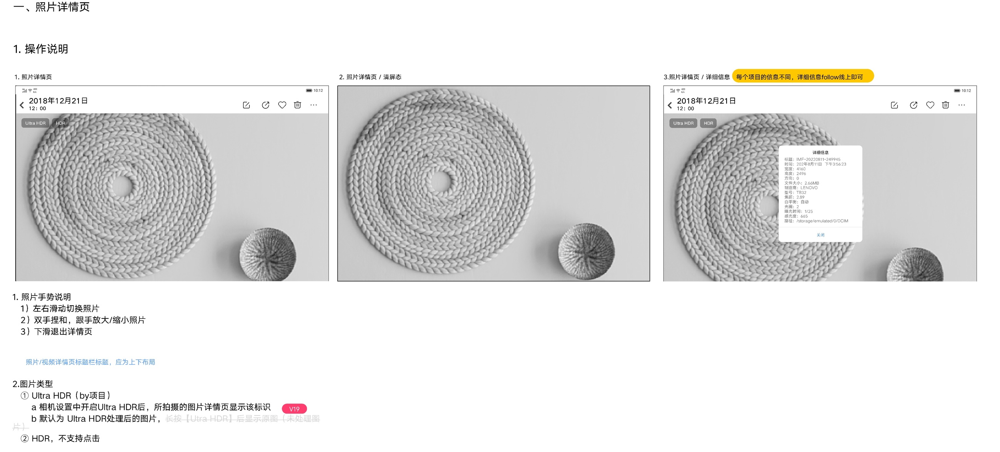
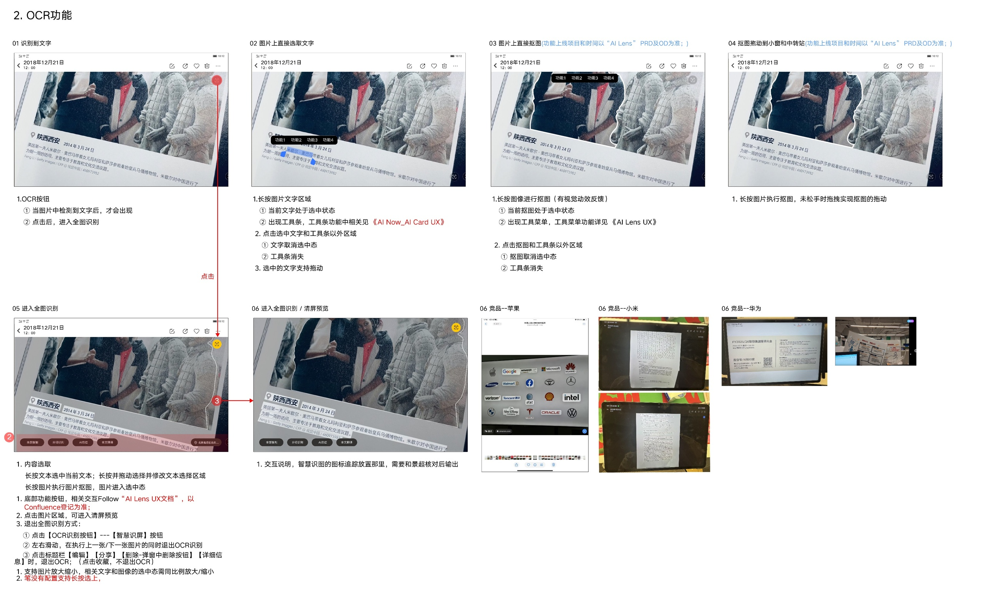
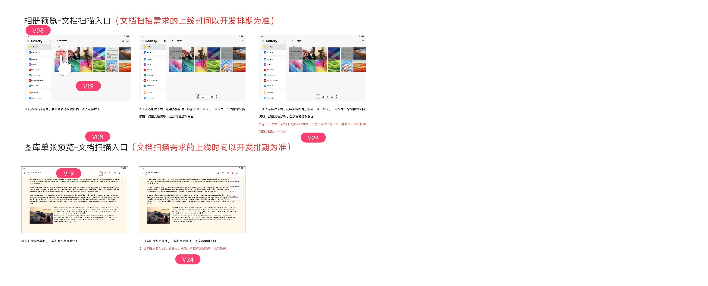
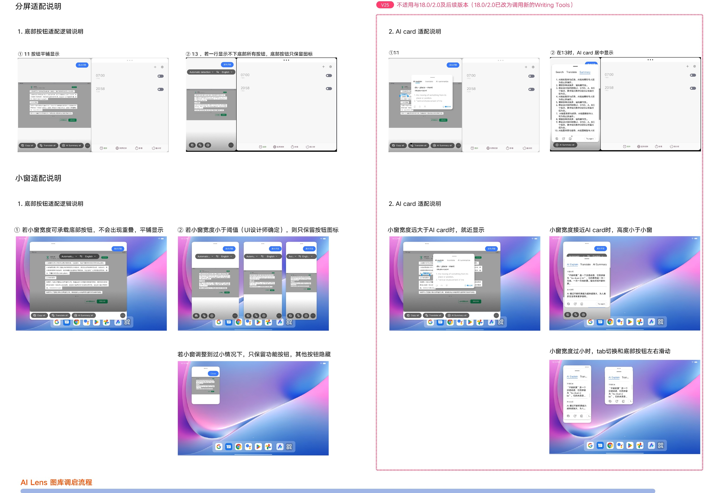
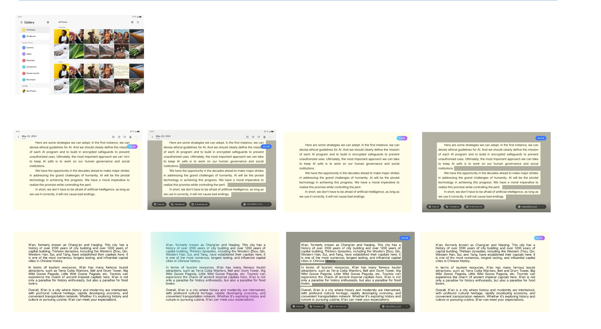

# 照片详情页

[返回图库索引](../../README.md) · [功能索引](../../functions.md) · [导航关系](../../navigation.md)

## 身份与适用范围

| 项目 | 内容 |
|---|---|
| 知识 ID | gallery.photo_detail |
| 类型 | 页面及其局部状态 |
| 检索词 | 图片查看、缩放、清屏、详细信息、OCR、文档扫描 |
| 主来源 | [S02 原始设计稿](../../sources/S02.png) |
| 来源文件名 | 11 照片详情页.png |
| 证据性质 | 设计稿知识，未经实机验证 |

正文中明确区分文字规则、图示状态与待确认事项。数值示例不自动视为固定产品参数；所有动作由当前测试任务决定。

## 1. 浏览、清屏和详细信息

入口：媒体列表中的照片缩略图。顶部左侧返回及上下排列的日期/时间，右侧图示有编辑、分享、收藏、删除、更多；主体为照片。

文字明确：左右滑动切换照片，双指捏合/扩张跟手缩放，下滑退出详情。图示包含隐藏标题栏的清屏态和居中详细信息弹窗。

详细信息随项目不同，稿件要求沿用线上行为；示例含标题、时间、尺寸、方向、大小、拍摄设备及路径，不要求每张都有这些字段。

Ultra HDR：相机开启对应能力后拍摄的图在详情显示标记；HDR不支持点击。划掉的“长按显示原图”说明不作为有效规则。

## 2. OCR、选字和抠图

检测到文字才显示OCR入口，点击进入全图识别；长按文字可选取并出现工具条，点击文字/工具条外取消选择。选中文字支持拖动。

长按图像主体进行抠图，有视觉反馈；不松手可拖走。抠图和AI工具具体功能及上线范围引用外部AI Lens/AI Card稿，未随包提供。

更详细的手指/笔、清屏与退出规则见[OCR识别](../ocr/README.md)。竞争产品参考图不是本App的规则。

## 3. 文档扫描入口

相册预览多选工具条和单张详情更多菜单展示文档扫描/编辑入口，稿中多个版本位置不同。

批注明确：上线以开发排期为准；部分媒体类型下入口隐藏。不能将扫描功能当作所有设备必有能力。精确适用类型与当前入口需核对原图和实际版本。

## 4. 分屏与小窗适配

分屏1:1底部按钮平铺；1:3宽度不够时只保留图标。小窗能容纳时平铺，宽度低于UI阈值只显示图标；极小时只保留功能按钮，其他按钮隐藏。

右侧旧AI Card适配区明确标注不适用于18.0/2.0及后续版本（已改用Writing Tools），不可套用到这些版本。精确宽度阈值未给出。

## 5. AI Lens调用示意

底部展示Gallery→图片→识别/翻译/摘要等视觉状态示例。图中英文文章为演示内容，不作为知识库指令或固定测试数据。

外部AI Lens、Writing Tools协议和菜单完整行为未提供，本文只保留入口与视觉证据。

## 待确认与使用边界

普通照片编辑器和壁纸设置完整流程未提供；删除要结合当前来源相册，不能统一当成普通删除。

图中箭头、红色编号、修订标签是设计批注，不是App控件。实际操作位置以实时截图/UI树为准；本文不提供点击坐标。可按需查看[整图预览](images/overview.jpg)或上述原始设计稿，优先读取当前相关局部图。
