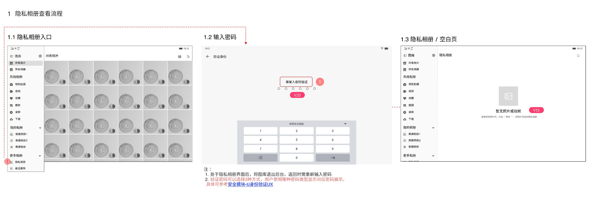
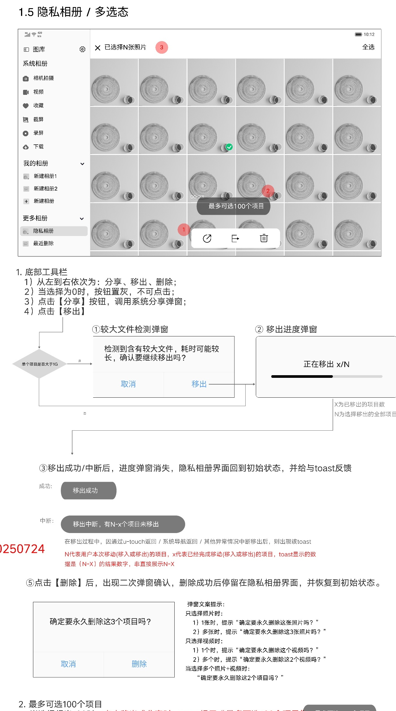
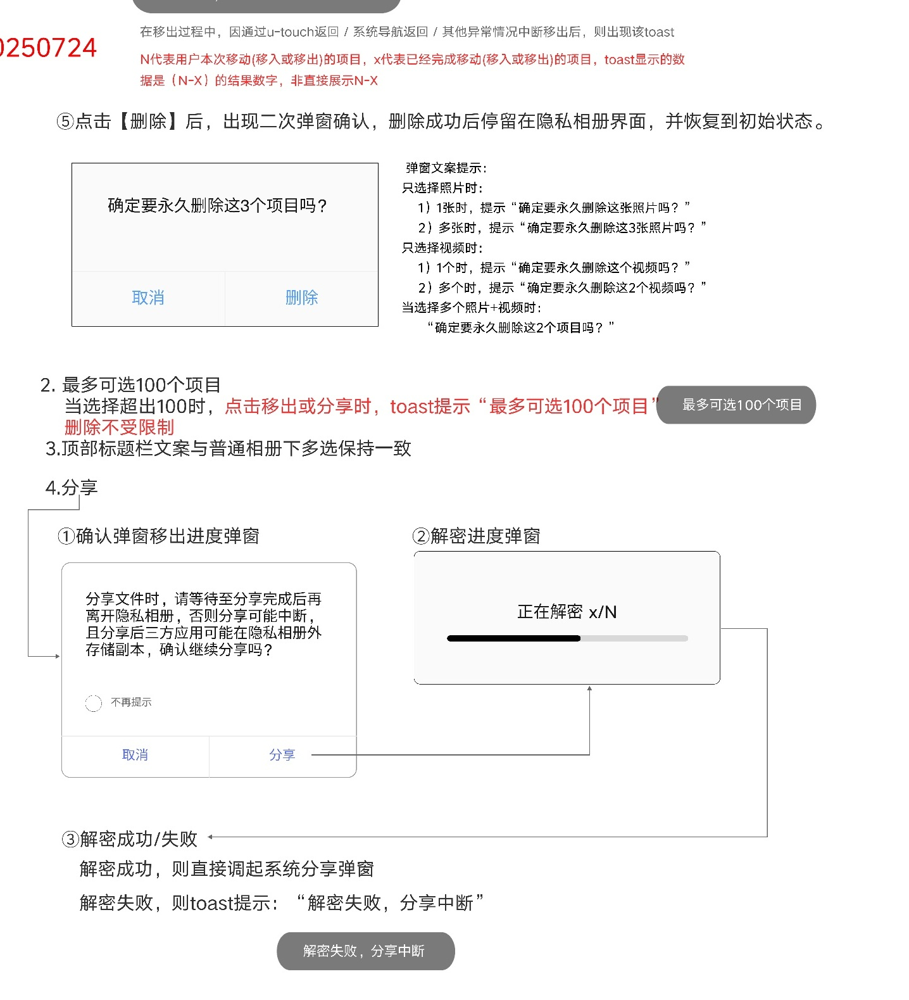
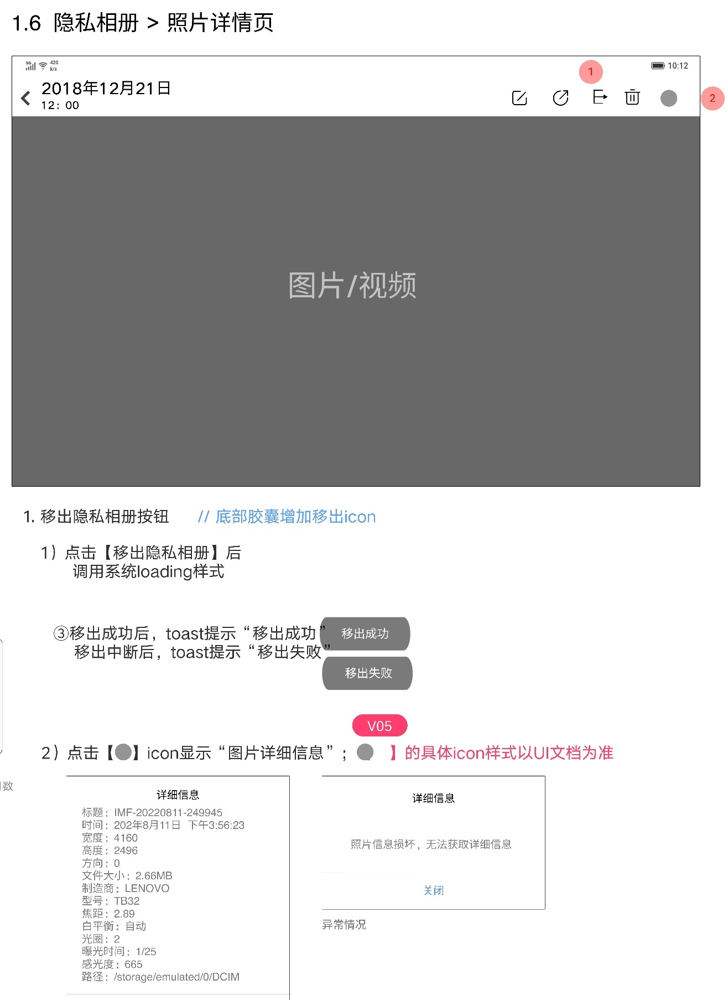
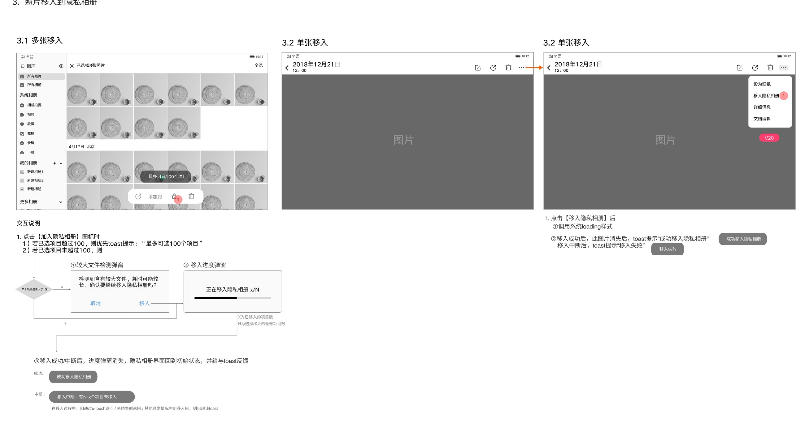
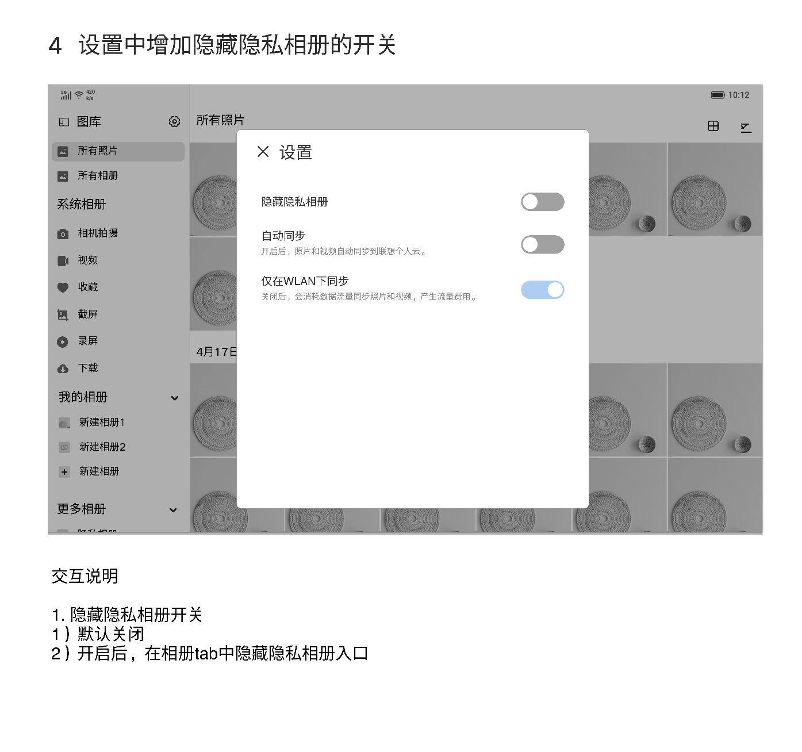

# 隐私相册

[返回图库索引](../../README.md) · [功能索引](../../functions.md) · [导航关系](../../navigation.md)

## 身份与适用范围

| 项目 | 内容 |
|---|---|
| 知识 ID | gallery.private_album |
| 类型 | 页面及其局部状态 |
| 检索词 | 密码验证、移入移出、隐私分享、永久删除、隐藏入口 |
| 主来源 | [S19 原始设计稿](../../sources/S19.png) |
| 来源文件名 | 9 隐私相册.png |
| 证据性质 | 设计稿知识，未经实机验证 |

正文中明确区分文字规则、图示状态与待确认事项。数值示例不自动视为固定产品参数；所有动作由当前测试任务决定。

## 1. 入口与验证

入口：左侧更多相册→隐私相册。先显示验证身份，使用用户实际设置的密码类型；稿件引用安全模块身份验证UX，未提供其完整规则。

图库在隐私相册时退到后台，再返回需重新验证。空态显示“暂无照片或视频”，并引导从单张图片的更多入口添加。

入口不见时检查[设置](../settings/README.md)的隐藏隐私相册开关，不应直接判定没有隐私功能。

## 2. 列表、多选及移出

隐私相册多选底部依次为分享、移出、删除。零选择时禁用。标题的照片/视频/混合数量文案与普通媒体多选一致。

移出：存在单个大于1G的项目时，先弹耗时确认；继续则出现“正在移出 x/N”。x为完成数，N为总数。

完成后回隐私相册初始状态并提示“移出成功”；中断提示剩余未移出数，显示实际N−x的数值，而不是字面算式。单张详情移出使用系统loading；中断示例文案为“移出失败”。

多选超过100项时，点击移出或分享才提示“最多可选100个项目”；删除不受此限制。不能将其解释为绝不允许选择第101项。

## 3. 删除与分享

隐私删除是永久删除，弹二次确认；按照片、视频、混合项目及数量变化文案。成功后留在隐私相册并回初始状态，不套用普通相册的最近删除规则。

分享先提示需等待完成、第三方可能保留副本，并提供“不再提示”。确认分享→“正在解密 x/N”→成功后系统分享弹窗；解密失败Toast“解密失败，分享中断”。

普通“分享直接调系统弹窗”的概述应结合此更具体解密流程理解。

## 4. 单张详情与信息

详情顶部有移出隐私相册入口；信息图标打开详细信息。信息损坏示例显示“照片信息损坏，无法获取详细信息”。具体图标以UI稿为准。

隐私详情的工具与普通详情不同，不能自动套用收藏、添加到等所有操作。

## 5. 从普通相册移入

多选媒体底部锁形“加入隐私相册”：超过100项先提示上限；不超过100项时，若单个项目大于1G，弹耗时确认；随后显示“正在移入隐私相册 x/N”。

完成Toast“成功移入隐私相册”；中断反馈剩余项数。原文关于移入后“隐私相册界面回到初始状态”与起点普通相册存在表述歧义，不强行定义落点。

单张：照片详情→右上更多→移入隐私相册。系统loading后，成功则当前图片消失并提示成功；失败提示“移入失败”。

## 6. 隐藏入口设置

设置中的“隐藏隐私相册”默认关闭；开启后隐藏相册tab中的隐私相册入口。稿件注明设置以模态弹窗显示，样式暂保持线上；隐私相册分栏待排期优化。

## 待确认与使用边界

身份验证具体方式和失败锁定规则依外部安全UX；移出目的相册未明确；图中版本批注不是实机验证。

图中箭头、红色编号、修订标签是设计批注，不是App控件。实际操作位置以实时截图/UI树为准；本文不提供点击坐标。可按需查看[整图预览](images/overview.jpg)或上述原始设计稿，优先读取当前相关局部图。
