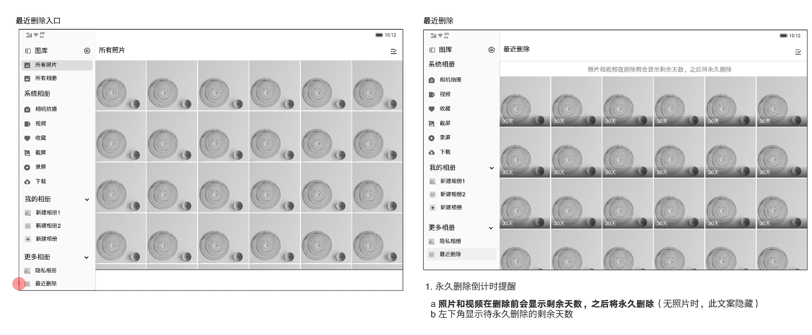
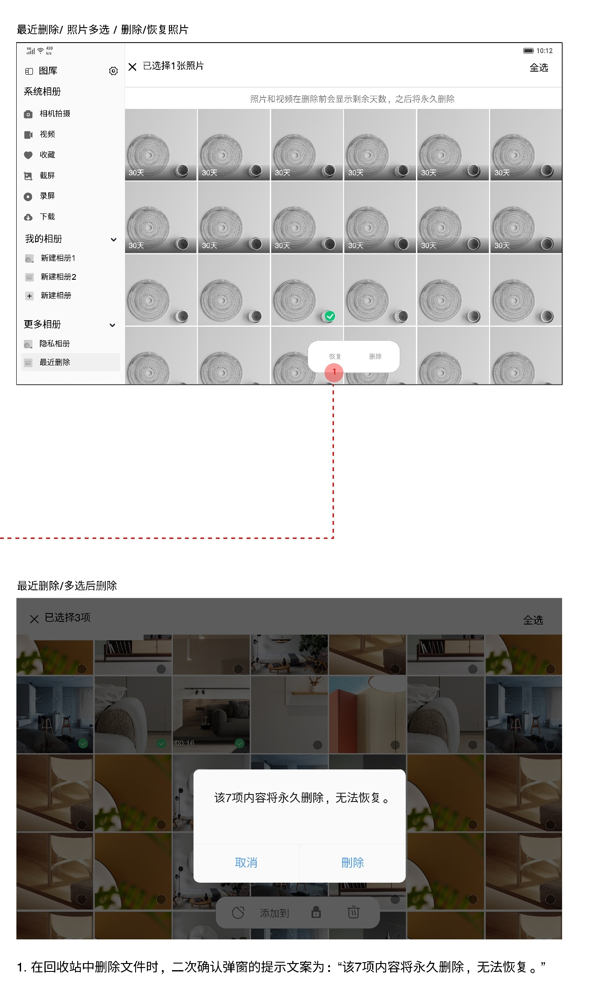
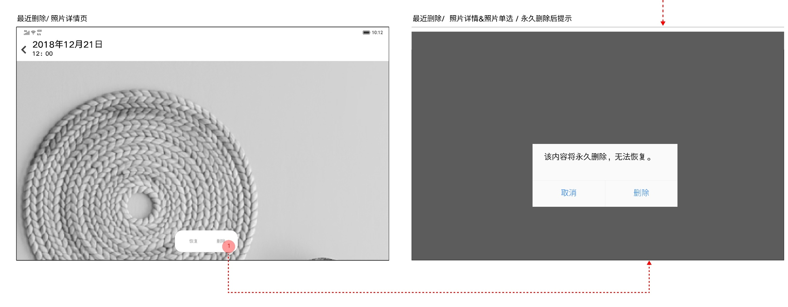
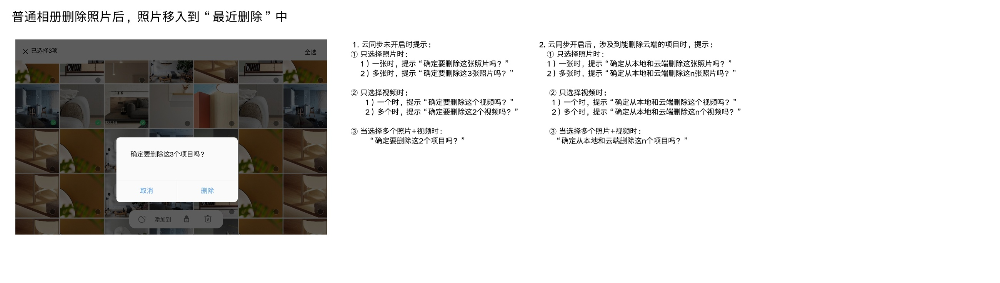

# 最近删除

[返回图库索引](../../README.md) · [功能索引](../../functions.md) · [导航关系](../../navigation.md)

## 身份与适用范围

| 项目 | 内容 |
|---|---|
| 知识 ID | gallery.recently_deleted |
| 类型 | 页面及其局部状态 |
| 检索词 | 回收站、恢复、剩余天数、永久删除、云端删除 |
| 主来源 | [S01 原始设计稿](../../sources/S01.png) |
| 来源文件名 | 10 最近删除.png |
| 证据性质 | 设计稿知识，未经实机验证 |

正文中明确区分文字规则、图示状态与待确认事项。数值示例不自动视为固定产品参数；所有动作由当前测试任务决定。

## 1. 入口与倒计时

入口：左侧更多相册→最近删除。网格缩略图左下显示距永久删除的剩余天数；顶部有倒计时说明，无照片时隐藏该说明。

图示为30天，不据示例独立推断所有版本统一保留期限。

## 2. 多选与永久删除

多选底部可见恢复、删除；永久删除二次确认：“该{n}项内容将永久删除，无法恢复。”按钮取消/删除。未确认前不是已删除。

最近删除使用自己的操作集合，不显示普通相册的分享、添加到或加入隐私菜单。

## 3. 详情中的永久删除

单张详情顶部日期时间，底部恢复与删除。删除提示“该内容将永久删除，无法恢复。”图中恢复入口存在，但未明确恢复后落点、成功提示和失败行为。

## 4. 普通删除与云同步差异

普通相册删除照片后移入最近删除。云同步未开启时，确认文案按照片/视频/混合和单复数显示“确定要删除…”。

开启云同步且涉及删除云端项目时，文案明确“确定从本地和云端删除…”。不要将仅本地删除与云端同步删除混淆。

图库[隐私相册](../private_album/README.md)的永久删除另有规则。最近删除分栏注明暂保持现状、待优化。

## 待确认与使用边界

保留时长全局值、恢复目标及云同步关闭后的数据行为未完整定义。

图中箭头、红色编号、修订标签是设计批注，不是App控件。实际操作位置以实时截图/UI树为准；本文不提供点击坐标。可按需查看[整图预览](images/overview.jpg)或上述原始设计稿，优先读取当前相关局部图。
