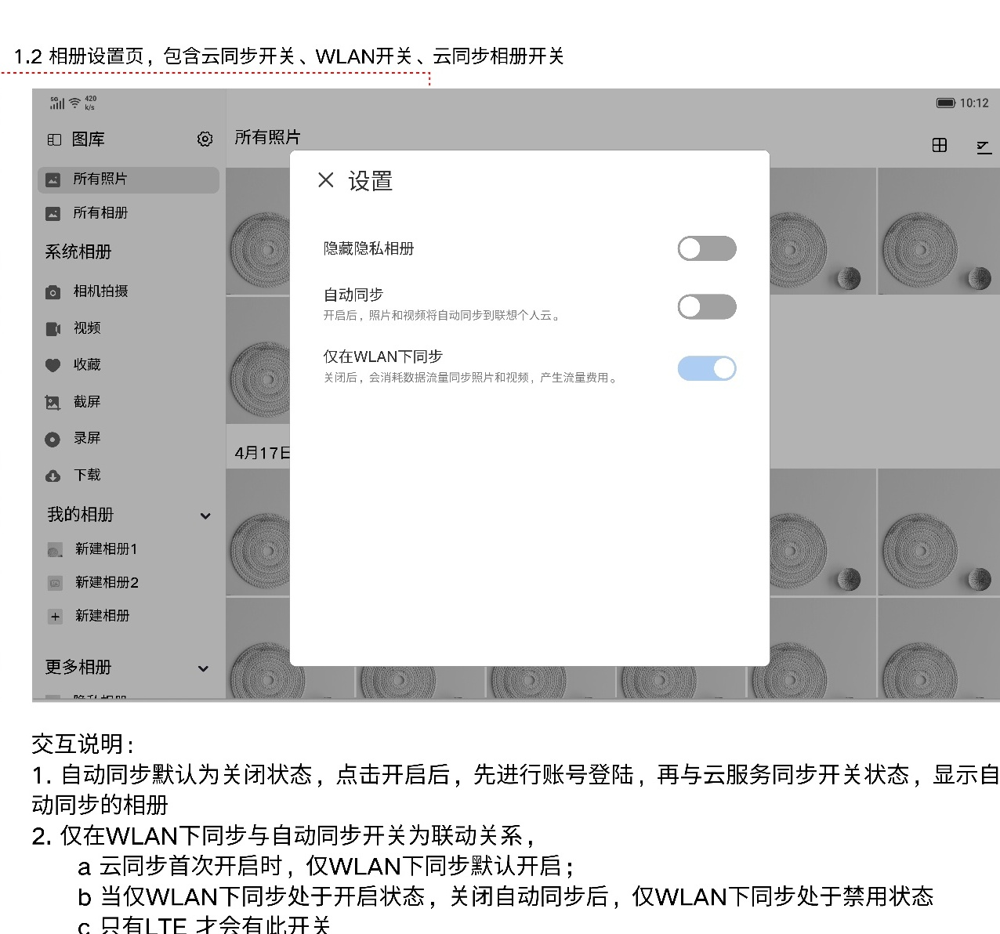
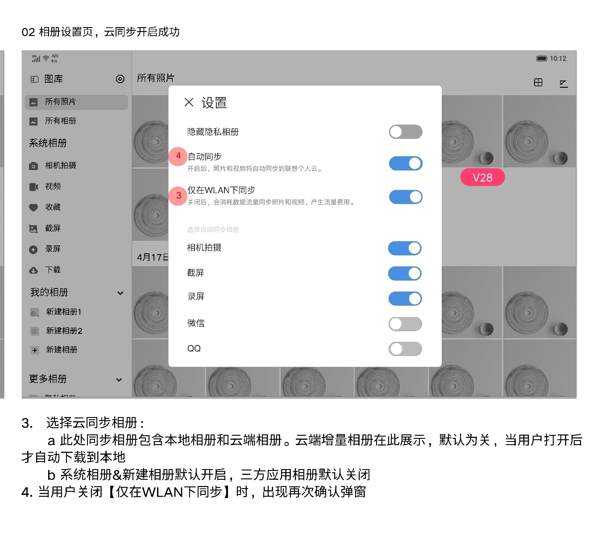

# 图库设置

[返回图库索引](../../README.md) · [功能索引](../../functions.md) · [导航关系](../../navigation.md)

## 身份与适用范围

| 项目 | 内容 |
|---|---|
| 知识 ID | gallery.settings |
| 类型 | 页面及其局部状态 |
| 检索词 | 隐藏隐私相册、自动同步、WLAN、同步相册 |
| 主来源 | [S05 原始设计稿](../../sources/S05.png) |
| 来源文件名 | 13 云同步.png |
| 证据性质 | 设计稿知识，未经实机验证 |

正文中明确区分文字规则、图示状态与待确认事项。数值示例不自动视为固定产品参数；所有动作由当前测试任务决定。

## 1. 入口和设置面板

入口：首页分栏顶部齿轮。设计为居中模态设置面板，左上X关闭；不是已确认的独立全屏Activity。

主要项：隐藏隐私相册、自动同步、仅在WLAN下同步。稿件注明设置弹窗样式暂维持线上。

## 2. 同步开关与相册选择

自动同步默认关闭；开启先处理账号登录，再与云服务同步开关状态，显示自动同步相册。

云同步开启后，仅WLAN同步默认开启；云同步关闭时该项禁用。说明限定只有LTE才有此开关；不能据普通示意图推断所有型号都有。

关闭“仅在WLAN下同步”会出现再次确认。系统相册和新建相册默认同步；第三方应用相册默认关闭；云端相册也列出，其开关默认关，开启后自动下载到本地。

隐藏隐私相册默认关，开启隐藏入口；该规则来源[隐私相册](../private_album/README.md)原稿末段。

## 待确认与使用边界

同步确认框全文、账号登录页、型号适用范围不完整；详细数据状态见云同步。

图中箭头、红色编号、修订标签是设计批注，不是App控件。实际操作位置以实时截图/UI树为准；本文不提供点击坐标。可按需查看[整图预览](images/overview.jpg)或上述原始设计稿，优先读取当前相关局部图。
