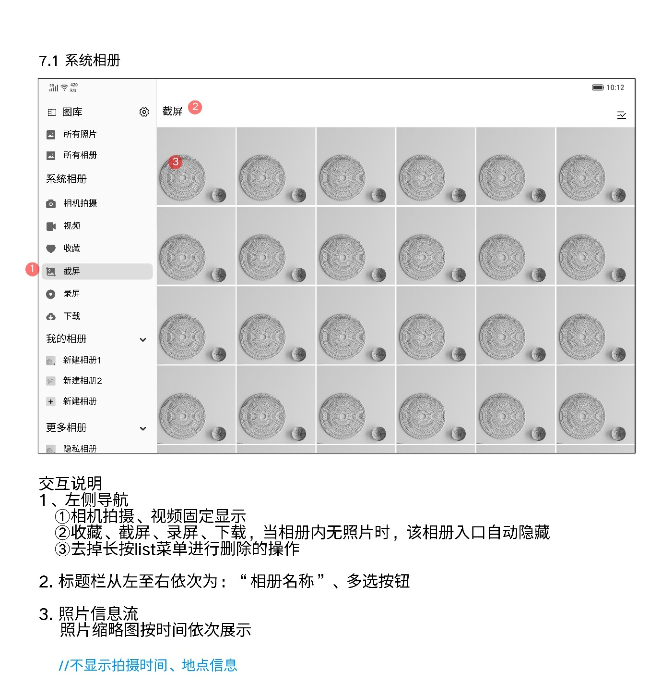
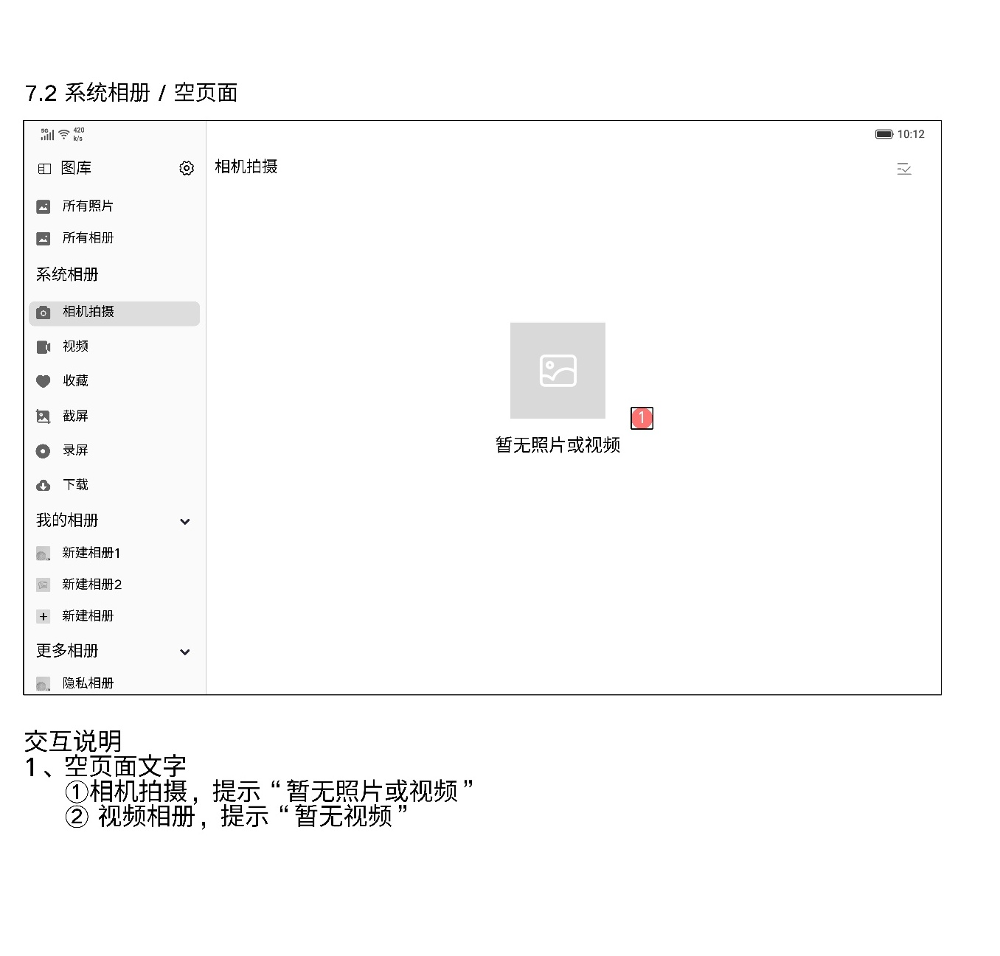

# 系统相册

[返回图库索引](../../README.md) · [功能索引](../../functions.md) · [导航关系](../../navigation.md)

## 身份与适用范围

| 项目 | 内容 |
|---|---|
| 知识 ID | gallery.system_albums |
| 类型 | 页面及其局部状态 |
| 检索词 | 相机拍摄、视频、收藏、截屏、录屏、下载、空态 |
| 主来源 | [S17 原始设计稿](../../sources/S17.png) |
| 来源文件名 | 7 系统相册.png |
| 证据性质 | 设计稿知识，未经实机验证 |

正文中明确区分文字规则、图示状态与待确认事项。数值示例不自动视为固定产品参数；所有动作由当前测试任务决定。

## 1. 分类入口与媒体列表

入口在首页左侧系统相册区，也可从所有相册的系统相册卡片进入。

相机拍摄、视频固定显示；收藏、截屏、录屏、下载在相册内无照片时自动隐藏入口。取消长按左侧列表进行删除的操作。

标题栏为相册名称和多选按钮。缩略图按时间排列，但不显示拍摄时间、地点分组信息。媒体多选参见[所有照片](../all_photos/README.md)。

## 2. 空态

相机拍摄空态为“暂无照片或视频”；视频空态为“暂无视频”。不要把空态当加载失败。

系统相册不适用用户相册删除、重命名、拖动排序规则。

## 待确认与使用边界

隐藏规则是否适用于所有相册卡片与左侧入口的全部场景，稿件未逐项说明。

图中箭头、红色编号、修订标签是设计批注，不是App控件。实际操作位置以实时截图/UI树为准；本文不提供点击坐标。可按需查看[整图预览](images/overview.jpg)或上述原始设计稿，优先读取当前相关局部图。
