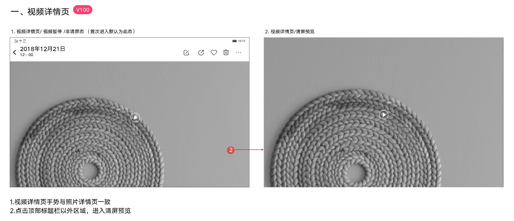
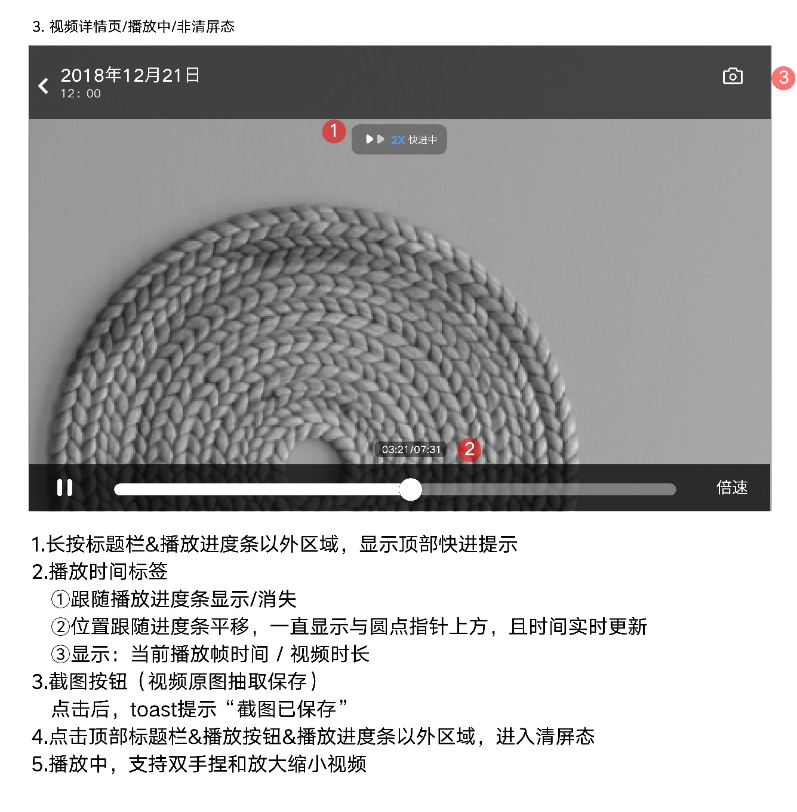
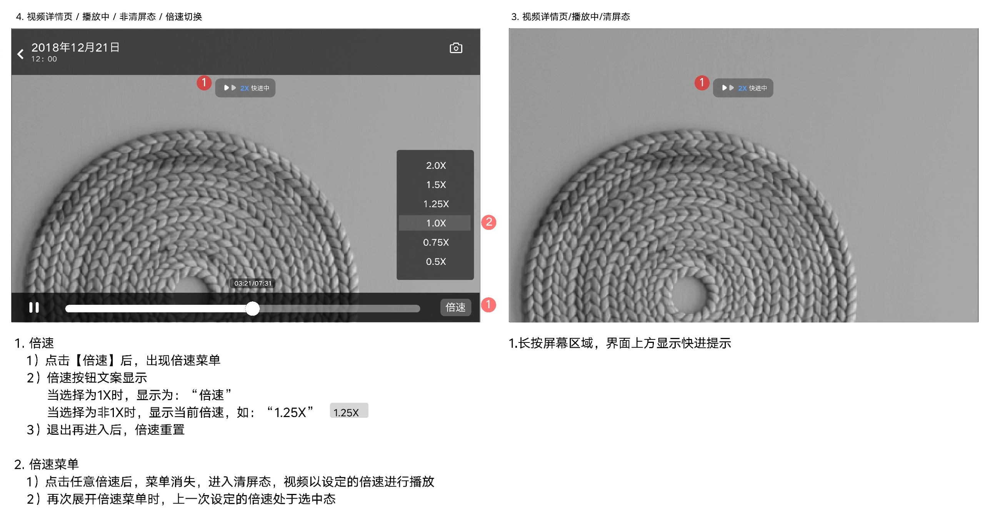
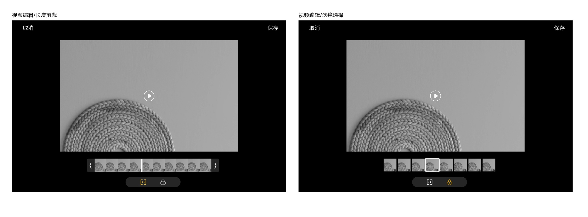

# 视频详情页

[返回图库索引](../../README.md) · [功能索引](../../functions.md) · [导航关系](../../navigation.md)

## 身份与适用范围

| 项目 | 内容 |
|---|---|
| 知识 ID | gallery.video_detail |
| 类型 | 页面及其局部状态 |
| 检索词 | 播放、暂停、倍速、快进、截图、视频编辑 |
| 主来源 | [S04 原始设计稿](../../sources/S04.png) |
| 来源文件名 | 12 视频详情页.png |
| 证据性质 | 设计稿知识，未经实机验证 |

正文中明确区分文字规则、图示状态与待确认事项。数值示例不自动视为固定产品参数；所有动作由当前测试任务决定。

## 1. 初始与清屏预览

首次进入默认视频暂停、非清屏；中间播放按钮，顶部日期时间与工具。视频详情手势沿用照片详情；点击顶部标题栏外区域进入清屏预览。

一般浏览手势见[照片详情](../photo_detail/README.md)，不要把播放时所有触点当同一行为。

## 2. 播放控制

播放非清屏态底部有暂停、进度条和倍速，顶部右侧截图按钮。播放时间标签随进度条出现/消失，位于圆点指针上方并随进度平移，显示当前播放时间/视频时长。

长按标题栏及进度条之外显示顶部快进提示（图示2X）；点击标题栏、播放按钮、进度条以外区域进入清屏；播放支持双指放大缩小。

截图保存视频原图，点击后Toast“截图已保存”。

## 3. 倍速与播放清屏

点击倍速打开菜单，图示0.5X、0.75X、1.0X、1.25X、1.5X、2.0X。

1X按钮文案“倍速”，非1X显示实际倍率。选倍率后菜单关闭，进入清屏按所选速度播放；再次开菜单保留当前选中态；退出再进入详情倍率重置。

清屏播放时长按屏幕也显示顶部快进提示。快进松手后的精确恢复规则未说明。

## 4. 编辑界面

展示视频长度裁剪和滤镜选择两种编辑状态：顶部取消/保存，底部时间帧/滤镜及模式切换。裁剪长度上限、覆盖还是另存、滤镜枚举未给出。

## 待确认与使用边界

图中编号重复不作为状态ID；播放自动结束、音量/亮度手势未定义。

图中箭头、红色编号、修订标签是设计批注，不是App控件。实际操作位置以实时截图/UI树为准；本文不提供点击坐标。可按需查看[整图预览](images/overview.jpg)或上述原始设计稿，优先读取当前相关局部图。
