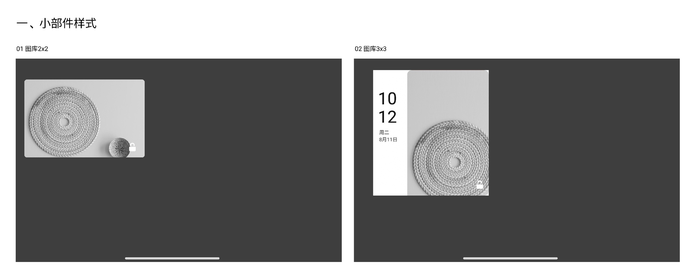
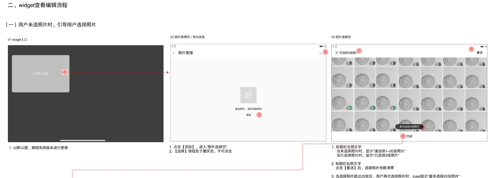
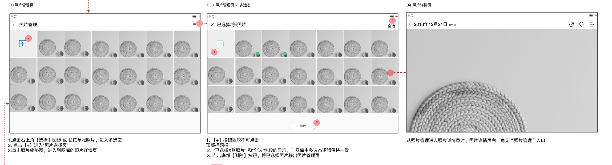
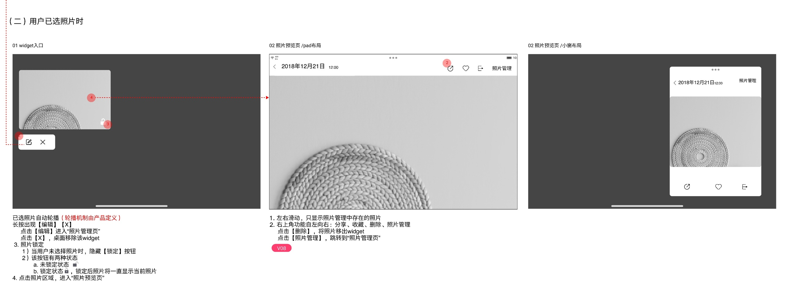

# 图库小部件与照片管理

[返回图库索引](../../README.md) · [功能索引](../../functions.md) · [导航关系](../../navigation.md)

## 身份与适用范围

| 项目 | 内容 |
|---|---|
| 知识 ID | gallery.widgets |
| 类型 | 页面及其局部状态 |
| 检索词 | 桌面、widget、20张、锁定轮播、照片管理 |
| 主来源 | [S07 原始设计稿](../../sources/S07.png) |
| 来源文件名 | 15 图库小部件 & 图库桌面图标.png |
| 证据性质 | 设计稿知识，未经实机验证 |

正文中明确区分文字规则、图示状态与待确认事项。数值示例不自动视为固定产品参数；所有动作由当前测试任务决定。

## 1. 小部件样式

桌面示例两种尺寸：图库2×2，图库3×3；3×3带时间日期侧栏。未选照片时显示随系统版本变化的默认图。

原文件名含桌面图标，但画布主要详细说明小部件；独立App图标菜单未完整展示。

## 2. 未选照片与选择页

点击未配置小部件进入照片管理空态；点击添加进入照片选择页，空态选择按钮置灰。

未选标题“请选择1～20张照片”；已选标题“已选择{n}张照片”。右上重选清空已选项；超20张再次选择Toast“最多选择20张照片”。底部完成或关闭后跳到照片管理页。

## 3. 管理列表与多选

照片管理页：右上选择或长按单张进入多选，网格+进入选择页，点击照片进入图库详情。

多选中+置灰；标题数量、全选/取消全选与图库一致；底部删除将选中项移出照片管理页。这里描述的是移出小部件管理列表，未说明删除原媒体。

从管理列表进入详情时，右上提供“照片管理”入口。

## 4. 已配置、锁定与预览

已选照片自动轮播，轮播机制由产品定义。长按小部件出现编辑与X；编辑进入照片管理，X移除桌面widget。

未选照片隐藏锁定按钮；已选时锁定/未锁定两态，锁定后持续显示当前照片。点击图片进入照片预览。

预览左右滑动仅遍历照片管理中的照片；右上功能从左到右为分享、收藏、删除、照片管理。删除将照片移出widget；照片管理返回管理页。图示同时有平板与小窗布局。

## 待确认与使用边界

多小部件是否共享数据、轮播间隔、退出持久化未定义。

图中箭头、红色编号、修订标签是设计批注，不是App控件。实际操作位置以实时截图/UI树为准；本文不提供点击坐标。可按需查看[整图预览](images/overview.jpg)或上述原始设计稿，优先读取当前相关局部图。
